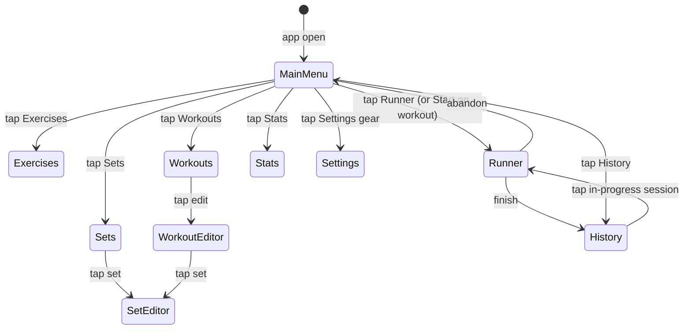

# dzerkout — Technical Architecture

**Version**: 1.1
**Date**: 2026-05-05
**Stack**: Tauri v2 · React · TypeScript · Vite · Rust · SQLite  
**Spec**: [SPEC.md](SPEC.md)

---

## 1. Architecture Overview

dzerkout is a three-layer local-first application. The React frontend handles
all rendering and user interaction. A Rust backend owns every database
operation, UUID generation, and domain-rule enforcement. SQLite is the single
source of truth.


**Why this design matches the spec:**

- All session transitions (snapshot, start, pause, resume, next, prev, skip,
  finish, abandon) are atomic DB writes owned by Rust. The frontend never
  derives new state — it receives the authoritative result of each command.
- Timer display is a pure derivation (`Date.now() - setStartedAt -
  paused_total_sec * 1000`) computed every render frame from DB-sourced base
  values in Zustand. Paused time never accumulates incorrectly.
- The two-layer state split (TanStack Query for persistent entity data; Zustand
  for live session state) keeps the active-runner responsive without
  complicating the rest of the app.

---

## 2. Runtime Model

| Concern | Runs in | Persisted immediately? |
|---|---|---|
| All UI rendering | React | — |
| Form state, search, modals | React local state | No |
| Exercise/template/history data | TanStack Query (fetches via Rust) | On mutation |
| Active session snapshot | Zustand `sessionStore` (loaded from DB) | On every command |
| Timer display value | React (derived from Zustand base values) | Never persisted |
| Timer base values (started_at, paused_at, paused_total_sec) | Zustand | On Pause / Resume / Next set crossing |
| User preferences (theme, auto-advance, sound, etc.) | Zustand `settingsStore` (persisted to localStorage) | On every change |
| All SQL — snapshot, transitions, corrective Prev | Rust domain services | Yes, in transactions |
| UUID generation | Rust | Yes |
| Schema migrations | Rust (startup) | Yes |
| Platform detection (macOS vs Android) | React (`@tauri-apps/plugin-os`) | No |

**Nothing in React accumulates time independently.** The timer formula always
references `DB-sourced` base values. This means pause/resume, app backgrounding,
and recovery after a crash all produce the same correct display.

---

## 3. Module / Folder Structure

```
dzerkout/
├── src-tauri/
│   ├── Cargo.toml
│   ├── tauri.conf.json
│   ├── build.rs
│   ├── migrations/
│   │   ├── 001_initial_schema.sql
│   │   ├── 002_fork_provenance.sql
│   │   ├── 003_workout_local_sets.sql
│   │   ├── 004_exercise_performed_duration.sql
│   │   ├── 005_rest_between_sets.sql
│   │   ├── 006_exercise_tags.sql
│   │   ├── 007_exercise_catalog_metadata.sql
│   │   ├── 008_exercise_pose_types.sql
│   │   └── 009_exercise_sanskrit_name.sql
│   ├── seeds/
│   │   └── default_library.json      # bundled via include_str! in lib.rs
│   └── src/
│       ├── main.rs                   # Tauri app entry point
│       ├── lib.rs                    # Plugin + command registration; calls seed_if_empty
│       ├── error.rs                  # AppError enum, thiserror + serde
│       ├── db/
│       │   ├── mod.rs                # SqlitePool init, after_connect pragmas
│       │   ├── exercises.rs          # SQL functions for exercises + tags + muscles
│       │   │                         #   + pose types + catalog source listing
│       │   ├── set_templates.rs      # SQL functions for templates + cards
│       │   ├── workout_templates.rs  # SQL for templates, set refs, assignments
│       │   ├── sessions.rs           # SQL for sessions, sets, exercises
│       │   ├── history.rs            # SQL for history queries
│       │   └── stats.rs              # SQL for stats aggregation queries
│       ├── domain/
│       │   ├── mod.rs
│       │   ├── types.rs              # Shared structs + validation constants
│       │   ├── exercise.rs           # Exercise service (unlink logic)
│       │   ├── set_template.rs       # SetTemplate service (clone, reorder)
│       │   ├── workout_template.rs   # WorkoutTemplate service (assignments)
│       │   ├── session.rs            # Session service (snapshot, all transitions)
│       │   ├── library.rs            # Export, import, seed, clear, reset
│       │   └── stats.rs              # Stats aggregation; StatsRange, StatsPayload
│       └── commands/
│           ├── mod.rs
│           ├── exercises.rs
│           ├── set_templates.rs
│           ├── workout_templates.rs
│           ├── sessions.rs
│           ├── history.rs
│           ├── stats.rs              # get_stats command
│           ├── library.rs            # export/import/reset/clear commands
│           └── file_io.rs            # write_text_to_uri, read_text_from_uri
│
├── src/
│   ├── main.tsx
│   ├── App.tsx                       # HashRouter shell; AppShell with Routes
│   ├── api/                          # Typed invoke() wrappers, one file per domain
│   │   ├── exercises.ts
│   │   ├── setTemplates.ts
│   │   ├── workoutTemplates.ts
│   │   ├── sessions.ts
│   │   ├── history.ts
│   │   ├── library.ts                # export/import/reset/clear
│   │   ├── stats.ts                  # getStats
│   │   └── fileExport.ts             # saveJsonToFile, pickJsonFile, readJsonFile
│   ├── store/
│   │   ├── sessionStore.ts           # Zustand: active session + timer base values
│   │   ├── settingsStore.ts          # Zustand persist: theme, runner prefs, sound
│   │   └── uiStore.ts                # Zustand: platform flag, global modal state
│   ├── hooks/
│   │   ├── useTimer.ts               # useElapsedMs, useExerciseElapsedMs
│   │   ├── usePlatform.ts            # @tauri-apps/plugin-os: sets isAndroid
│   │   ├── useSessionRecovery.ts     # On-mount draft / in-progress check
│   │   └── useCountdownCues.ts       # Web Audio countdown cue firing
│   ├── theme/
│   │   └── tokens.ts                 # 5 themes, CSS custom props, applyThemeToDOM
│   ├── audio/
│   │   └── cues.ts                   # playBeep, playPreviewCue, CUE_SECONDS
│   ├── screens/
│   │   ├── MainMenu/
│   │   │   └── index.tsx             # Navigation dashboard (app home)
│   │   ├── ExerciseLibrary/
│   │   │   ├── index.tsx
│   │   │   ├── ExerciseCard.tsx
│   │   │   └── ExerciseForm.tsx
│   │   ├── SetTemplateBuilder/
│   │   │   ├── index.tsx             # List view
│   │   │   ├── SetEditor.tsx         # Builder view
│   │   │   └── CardEditor.tsx        # Popover: edit card fields
│   │   ├── WorkoutTemplateBuilder/
│   │   │   ├── index.tsx             # List view (= SavedWorkouts)
│   │   │   ├── WorkoutEditor.tsx     # Builder view
│   │   │   └── AssignmentEditor.tsx  # Popover: workout-specific overrides
│   │   ├── ActiveWorkoutRunner/
│   │   │   ├── index.tsx
│   │   │   ├── TimerDisplay.tsx
│   │   │   ├── ExerciseQueue.tsx
│   │   │   └── RunnerControls.tsx
│   │   ├── WorkoutHistory/
│   │   │   ├── index.tsx
│   │   │   └── SessionDetail.tsx
│   │   ├── Stats/
│   │   │   └── index.tsx
│   │   └── Settings/
│   │       └── index.tsx             # Appearance / Runner / Sound / Data tabs
│   ├── components/
│   │   ├── SortableList/             # dnd-kit + Android button fallback
│   │   │   └── index.tsx
│   │   ├── ConfirmModal.tsx
│   │   └── ErrorBoundary.tsx
│   └── types/                        # TypeScript types mirroring Rust structs
│       ├── exercise.ts
│       ├── setTemplate.ts
│       ├── workoutTemplate.ts
│       ├── session.ts
│       ├── library.ts                # ImportResult, ResetResult, ClearResult
│       └── stats.ts                  # StatsPayload, StatsSummary, TagStat, ExerciseStat
│
├── scripts/
│   ├── README.md
│   ├── android-release.local.sh      # local signing helper (gitignored)
│   ├── generate-free-exercise-db-library.mjs
│   ├── generate-yoga-poses-library.mjs
│   └── generated/                    # gitignored script output
│
├── vendor/                           # gitignored source data for catalog generators
├── SPEC.md
├── ARCH.md
├── PERSISTENCE.md
├── ANDROID.md
├── package.json
├── vite.config.ts
└── tsconfig.json
```

---

## 4. Frontend Architecture

### 4.1 Routing

The app uses `HashRouter` with inline `<Routes>` declared in `App.tsx`. There
is no separate `router.tsx` file.

```typescript
// App.tsx (simplified)
function AppShell() {
  useSessionRecovery();
  useThemeApplicator();

  return (
    <div style={{ display: "flex", flexDirection: "column", height: "100vh" }}>
      <main style={{ flex: 1, minHeight: 0, overflow: ... }}>
        <Routes>
          <Route path="/"            element={<MainMenu />} />
          <Route path="/exercises"   element={<ExerciseLibrary />} />
          <Route path="/sets"        element={<SetTemplateBuilder />} />
          <Route path="/sets/:id"    element={<SetTemplateBuilder />} />
          <Route path="/workouts"    element={<WorkoutTemplateBuilder />} />
          <Route path="/workouts/:id" element={<WorkoutTemplateBuilder />} />
          <Route path="/runner"      element={<ActiveWorkoutRunner />} />
          <Route path="/history"     element={<WorkoutHistory />} />
          <Route path="/stats"       element={<Stats />} />
          <Route path="/settings"    element={<Settings />} />
        </Routes>
      </main>
      {confirmModal && <ConfirmModal ... />}
    </div>
  );
}

export default function App() {
  usePlatform();
  return (
    <HashRouter>
      <AppShell />
    </HashRouter>
  );
}
```

There is no persistent tab bar or sidebar. Navigation is hub-and-spoke from
`MainMenu` (`/`). The MainMenu shows an "Active" badge on the Runner button
when `sessionStore.sessionId !== null`. Settings is accessible via a gear
button in the top-right corner of MainMenu.

### 4.2 State Layering

**TanStack Query** manages all DB-backed read data — exercises, set templates,
workout templates, history, stats. Every mutation calls a Rust command then
invalidates the relevant query key(s). No data is stored redundantly.

**Zustand `sessionStore`** manages active-session state. It is the only place
timer base values live in the frontend. It is loaded from the command return
value after every state-changing command; there is no partial update.

**Zustand `settingsStore`** manages user preferences (theme, runner behavior,
sound). It is persisted to `localStorage` under the key `"dzerkout_settings"`.
See §7.4 for the full interface.

**Local component state** handles form fields (`react-hook-form`), search text,
modal visibility, and dnd-kit in-flight drag state.

### 4.3 Forms

Use `react-hook-form` with inline validation. Server-side domain errors
(`AppError::Conflict` for duplicate names, `AppError::Validation` for missing
required fields) are returned as typed JSON and merged into form error state via
`setError`. No custom validation framework is needed.

### 4.4 Drag-and-Drop Strategy

Desktop: `@dnd-kit/core` + `@dnd-kit/sortable`. The `SortableList` component
wraps a `DndContext` + `SortableContext`. On drag end, it calls `onReorder`
with the new ordered ID array, which maps to a Rust command (`reorder_cards` or
`reorder_set_refs`).

Android: `SortableList` detects `isAndroid` (from `uiStore`) and renders
up/down arrow buttons per item instead. Each button press calls `onReorder`
with a shifted array. No drag gesture is involved. The caller (builder screen)
passes a `renderFallbackControls` prop; the list is otherwise identical.

```tsx
// components/SortableList/index.tsx  (simplified)
export function SortableList<T extends { id: string }>({
  items, onReorder, renderItem, renderFallbackControls,
}: SortableListProps<T>) {
  const isAndroid = useUiStore(s => s.isAndroid);

  if (isAndroid) {
    return <>{items.map((item, i) => (
      <div key={item.id}>
        {renderItem(item)}
        {renderFallbackControls(item, i, items.length, onReorder)}
      </div>
    ))}</>;
  }

  return (
    <DndContext onDragEnd={e => handleDragEnd(e, items, onReorder)}>
      <SortableContext items={items.map(i => i.id)}>
        {items.map(item => (
          <SortableItem key={item.id} id={item.id}>
            {renderItem(item)}
          </SortableItem>
        ))}
      </SortableContext>
    </DndContext>
  );
}
```

### 4.5 Keyboard Shortcuts (desktop only)

Registered in `ActiveWorkoutRunner/index.tsx` behind `!isAndroid`:

```typescript
useEffect(() => {
  if (isAndroid) return;
  const onKey = (e: KeyboardEvent) => {
    if (e.key === 'ArrowRight') handleNext();
    if (e.key === 'ArrowLeft')  handlePrev();
    if (e.key === ' ')          handlePauseResume();
  };
  window.addEventListener('keydown', onKey);
  return () => window.removeEventListener('keydown', onKey);
}, [isAndroid]);
```

### 4.6 Theme System

Five themes are defined in `src/theme/tokens.ts`: `dark`, `graphite`, `forest`,
`ember`, `slate`. Each theme is a `ThemeTokens` object mapping token names to
concrete color values.

At runtime, `applyThemeToDOM(theme)` writes the active theme's values as CSS
custom properties on `document.documentElement`. The `tokens` object provides
`var(--name)` references for every token, which resolve to the currently applied
theme at render time.

The `useThemeApplicator` hook in `AppShell` calls `applyThemeToDOM` via
`useLayoutEffect` (fires synchronously before paint, eliminating first-frame
flash) whenever `settingsStore.theme` changes.

```typescript
// theme/tokens.ts (summary)
export type ThemeKey = "dark" | "graphite" | "forest" | "ember" | "slate";

export const tokens = {
  bg: "var(--bg)",
  bgElevated: "var(--bgElevated)",
  textPrimary: "var(--textPrimary)",
  // ... all token keys
};

export function applyThemeToDOM(t: ThemeTokens): void {
  const root = document.documentElement;
  Object.entries(t).forEach(([key, value]) => root.style.setProperty(`--${key}`, value));
}
```

The default theme (`"dark"`) is applied immediately before the first React
render via a small inline script in `index.html`.

### 4.7 Sound Cues / Web Audio

`src/audio/cues.ts` provides Web Audio countdown beeps for timed exercise and
rest phases.

```typescript
export const CUE_SECONDS: readonly number[] = [2, 1, 0, -1];
export const FINAL_CUE_SECOND = -1;

// 880 Hz countdown beep; 1320 Hz final tone
export function playBeep(isFinal: boolean): void { ... }

// Plays the full cue sequence with 500 ms gaps (for Settings preview)
export function playPreviewCue(): Promise<void> { ... }
```

`AudioContext` is lazily created as a singleton on the first call to avoid
autoplay policy issues.

The `useCountdownCues(remainingSec, phaseId, enabled, paused)` hook in
`src/hooks/useCountdownCues.ts` fires `playBeep` when `remainingSec` crosses a
cue-second boundary. It tracks fired cue-seconds per phase in a ref to prevent
duplicates across re-renders, and pre-seeds already-elapsed cues on phase change
to prevent stale replays when the app opens mid-countdown.

Sound cues are enabled by `settingsStore.soundCues`. The `phaseId` is
`null` for untimed exercises (no cues fire).

### 4.8 Exercise Library and Set-Card Exercise Picker

The Exercise Library screen and the `CardEditor` exercise picker share the same
backend-backed paginated search:

- **Data source.** Both views call `exercisesApi.searchExercises(filters)` →
  Rust `search_exercises` (see §5.2). Filtering and pagination happen on the
  server; the frontend never holds the full library in memory.
- **Filter state.** `ExerciseSearchFilters` carries free-text `query` (matched
  against `name` OR `sanskrit_name`), `source` (`all` / `user` / `catalog`),
  `catalog_source` (specific catalog), `category`, `equipment`, `level`,
  `force`, `primary_muscle`, `tag`, `pose_type`, plus `limit` and `offset`.
  `source = user` combined with a non-null `catalog_source` is rejected
  client-side before invoking; the UI hides the Source filter in that mode.
- **Source dropdown.** Both screens populate the **Source** filter from
  `exercisesApi.listCatalogSources()` (one row per distinct `catalog_source`
  with its row count). The broader **Library** filter (`all` / `user` /
  `catalog`) is a separate three-way control.
- **Page sizes.** Exercise Library uses `limit = 50`; the set-card picker uses
  `limit = 40`. Any change to query text or any filter resets `offset` to 0.
- **Selection stability.** In the Exercise Library, the selected exercise in
  the detail pane is preserved across page changes — the selected `id` is
  tracked in component state, not derived from the current page slice.
- **Add to set.** The Exercise Library detail pane's **Add to set** action
  reuses `setTemplatesApi.addCard` to append a `concrete` card to a chosen
  global (library) set. Workout-local forked sets are excluded from the target
  list. Duplicates are allowed; the optional duration hint and notes fields
  flow through to `addCard` unchanged. After success, TanStack Query
  invalidates `['set-templates']` and `['set-template', targetSetId]`.

---

## 5. Rust Backend Architecture

### 5.1 Command Layer (thin)

Commands in `commands/*.rs` do three things only:
1. Deserialize input from Tauri IPC.
2. Call the appropriate domain service function.
3. Return the result or `AppError`.

No SQL, no business logic, no UUID generation in command handlers.

### 5.2 Command Inventory

**exercises.rs**
- `list_exercises() → Vec<Exercise>`
- `get_exercise(id) → Exercise`
- `search_exercises(filters: ExerciseSearchFilters) → ExerciseSearchResult`
  — `ExerciseSearchFilters` includes free-text `query` (matched against both
  `name` and `sanskrit_name`), broad `source` (`all` / `user` / `catalog`),
  specific `catalog_source`, `category`, `equipment`, `level`, `force`,
  `primary_muscle`, `tag`, `pose_type`, plus `limit` and `offset` for
  pagination. Returns rows + total count for the page UI.
- `list_catalog_sources() → Vec<{ source: String, count: i64 }>`
  — drives the **Source** filter dropdown in Exercise Library and the
  set-card exercise picker.
- `create_exercise(name, sanskrit_name?, notes, tags?, muscles?, pose_types?, catalog metadata?) → Exercise`
- `update_exercise(id, name, sanskrit_name?, notes, tags?, muscles?, pose_types?) → Exercise`
- `get_exercise_references(id) → ExerciseReferences`
- `delete_exercise(id) → ()`

**set_templates.rs**
- `list_set_templates() → Vec<SetTemplateSummary>`
- `get_set_template(id) → SetTemplateDetail`
- `create_set_template(name, notes) → SetTemplate`
- `update_set_template(id, name, notes) → SetTemplate`
- `delete_set_template(id) → ()`
- `clone_set_template(id) → SetTemplate`
- `add_card(set_id, card_type, exercise_id?, placeholder_tag?, placeholder_label?, duration_hint_sec?, notes?) → SetTemplateCard`
- `update_card(card_id, ...) → SetTemplateCard`
- `remove_card(card_id) → ()`
- `reorder_cards(set_id, ordered_ids: Vec<String>) → ()`

**workout_templates.rs**
- `list_workout_templates() → Vec<WorkoutTemplateSummary>`
- `get_workout_template(id) → WorkoutTemplateDetail`
- `create_workout_template(name, notes, default_duration_sec, rest_sec?) → WorkoutTemplate`
- `update_workout_template(id, ...) → WorkoutTemplate`
- `delete_workout_template(id) → ()`
- `add_set_ref(workout_id, set_id) → WorkoutTemplateSetRef`
- `remove_set_ref(set_ref_id) → ()`
- `reorder_set_refs(workout_id, ordered_ids: Vec<String>) → ()`
- `clone_set_from_workout(set_ref_id) → WorkoutTemplateSetRef`
- `upsert_card_assignment(set_ref_id, card_id, exercise_id?, display_label?, duration_hint_sec?, notes?) → WorkoutTemplateCardAssignment`
- `delete_card_assignment(assignment_id) → ()`
- `export_forked_set(set_ref_id) → SetTemplateDetail`

**sessions.rs**
- `get_active_session() → Option<ActiveSessionPayload>`
- `create_session_draft(workout_template_id) → ActiveSessionPayload`
- `start_session(session_id) → ActiveSessionPayload`
- `pause_session(session_id, set_id) → ActiveSessionPayload`
- `resume_session(session_id, set_id) → ActiveSessionPayload`
- `advance_exercise(session_id) → ActiveSessionPayload`
- `retreat_exercise(session_id) → ActiveSessionPayload`
- `skip_exercise(session_id, exercise_id) → ActiveSessionPayload`
- `start_next_set(session_id) → ActiveSessionPayload`
- `finish_session(session_id) → WorkoutSession`
- `abandon_session(session_id) → ()`
- `discard_session(session_id) → ()`

**history.rs**
- `list_session_history() → Vec<SessionSummary>`
- `get_session_detail(session_id) → SessionDetail`

**stats.rs**
- `get_stats(range: String) → StatsPayload`  (`range`: `"all"` | `"30d"` | `"7d"`)

**library.rs**
- `export_library_json() → String`  (full JSON export including sessions)
- `import_library_json(json: String) → ImportResult`
- `reset_local_data() → ResetResult`  (clear + re-seed default library)
- `clear_local_data() → ClearResult`  (FK-safe delete of all user data)

**file_io.rs**
- `write_text_to_uri(path: String, content: String) → ()`
- `read_text_from_uri(path: String) → String`

### 5.3 Domain Service Layer

`domain/session.rs` is the most complex service. It owns:
- Snapshot creation: the full fallback chain resolving `exercise_id`,
  `display_name`, `duration_hint_sec`, and `notes` from assignments and cards.
- All state transitions: start, pause, resume, advance, retreat, skip,
  finish, abandon.
- Rest-phase management: `advance_exercise` enters a between-set rest phase
  when `rest_between_sets_sec > 0`; `start_next_set` ends rest and starts the
  next set; `skip_exercise` always bypasses rest.
- Corrective-Prev semantics: within-set and cross-set cases, including handling
  the rest-phase case (no active exercise, set in rest state).
- The implicit-resume rule: if `paused_at` is non-null when `advance`,
  `retreat`, `skip`, or `finish` is called, it performs the resume transaction
  first.

`domain/exercise.rs` owns the deletion-with-unlink transaction, handling all
three reference types (`SetTemplateCard`, `WorkoutTemplateCardAssignment`,
`WorkoutSessionExercise`) in a single atomic operation.

`domain/workout_template.rs` owns the `clone_set_from_workout` logic and
validates card counts for startability (at least one concrete or placeholder
card across all non-empty sets).

`domain/library.rs` owns:
- `export_full_library`: fetches all exercises (with tags and muscles),
  set templates, workout templates, sessions, session sets, and session
  exercises; serializes to the `dzerkout.library` JSON schema.
- `import_library_json`: upsert-based idempotent import in a single
  transaction; validates tags, muscles, and catalog metadata; writes in FK-safe
  order (exercises → tags → muscles → sets → set cards → workouts → set refs →
  assignments → sessions → session sets → session exercises).
- `seed_if_empty`: gates on all three template tables being empty; calls the
  import codepath with the bundled seed JSON.
- `clear_local_data`: FK-safe DELETE of all tables (reverse dependency order).
- `reset_local_data`: clear + seed_if_empty.

`domain/stats.rs` owns:
- `StatsRange` enum (`All`, `Days30`, `Days7`) with ISO 8601 cutoff computation.
- `get_stats(range_str)`: queries session, exercise, tag, and per-exercise
  aggregations and assembles `StatsPayload`.

### 5.4 Error Type

```rust
#[derive(Debug, thiserror::Error, serde::Serialize)]
#[serde(tag = "type", content = "message")]
pub enum AppError {
    #[error("Not found: {0}")]
    NotFound(String),
    #[error("Validation: {0}")]
    Validation(String),
    #[error("Conflict: {0}")]
    Conflict(String),
    #[error("No active session")]
    NoActiveSession,
    #[error("Database error")]
    Database(#[from] sqlx::Error),
}
impl tauri::ipc::IntoIpcResponse for AppError { ... }
```

Frontend maps the `type` discriminant to typed error handling. `Conflict`
surfaces as an inline form error. `Database` surfaces as a global error modal.

### 5.5 `ActiveSessionPayload` Pattern

Commands that drive the runner return a complete `ActiveSessionPayload` struct
rather than requiring the frontend to refetch:

```rust
pub struct ActiveSessionPayload {
    pub session:               WorkoutSession,
    pub sets:                  Vec<WorkoutSessionSet>,
    pub exercises:             Vec<WorkoutSessionExercise>,
    pub current_exercise_id:   Option<String>,
    pub current_set_id:        Option<String>,
    /// DB-sourced timer base values for the current set.
    /// Zustand derives elapsed time from these; nothing is accumulated in the frontend.
    pub timer_base:            TimerBase,
    /// Non-null when between sets (rest phase active).
    pub rest_phase:            Option<RestPhaseInfo>,
    /// Copied from the workout template; used by the frontend rest timer.
    pub rest_between_sets_sec: Option<i64>,
}

pub struct RestPhaseInfo {
    pub next_set_id:        String,
    pub rest_duration_sec:  i64,
    pub rest_started_at_ms: i64,
}
```

The frontend loads this payload wholesale into `sessionStore` after every
command. No partial-update logic is needed anywhere.

---

## 6. Persistence Architecture

### 6.1 Connection Management

Use `sqlx::SqlitePool` with `max_connections = 2`. Store in Tauri managed
state via `app.manage(pool)`. The DB file path is resolved at runtime using
`app.path().app_data_dir()`, which works correctly on both macOS and Android.
Connection strings follow the pattern:
`sqlite://{app_data_dir}/dzerkout.db?mode=rwc`.

### 6.2 Startup Configuration

Run once in `lib.rs` setup, before the Tauri app window opens:

```rust
// Pragmas are applied on every new connection via after_connect, not once at pool level.
let pool = SqlitePoolOptions::new()
    .max_connections(2)
    .after_connect(|conn, _meta| Box::pin(async move {
        sqlx::query("PRAGMA foreign_keys = ON").execute(conn).await?;
        sqlx::query("PRAGMA journal_mode = WAL").execute(conn).await?;
        sqlx::query("PRAGMA synchronous = NORMAL").execute(conn).await?;
        Ok(())
    }))
    .connect_with(opts)
    .await?;

sqlx::migrate!("migrations/").run(&pool).await?;

// Seed the library from the bundled JSON if the DB is completely empty.
seed_if_empty(&pool, include_str!("../seeds/default_library.json")).await?;
```

`after_connect` ensures pragmas apply to every connection in the pool, not just
the first one. `foreign_keys = ON` is required by spec; WAL mode allows reads
while writes proceed. `seed_if_empty` gates on all three template tables
(exercises, set_templates, workout_templates) being empty.

### 6.3 Migration Files

Migrations apply sequentially at startup:

| File | Change |
|---|---|
| `001_initial_schema.sql` | All core tables (exercises, set templates, workout templates, sessions, sets, exercises) |
| `002_fork_provenance.sql` | Adds `source_set_template_id` to `workout_template_set_refs` |
| `003_workout_local_sets.sql` | Adds `owning_workout_template_id` to `set_templates` (FK → workout_templates, ON DELETE CASCADE) |
| `004_exercise_performed_duration.sql` | Adds `paused_offset_sec`, `performed_duration_sec` to `workout_session_exercises` |
| `005_rest_between_sets.sql` | Adds `rest_duration_sec`, `rest_started_at` to `workout_session_sets` |
| `006_exercise_tags.sql` | Adds `exercise_tags` table (normalized, ON DELETE CASCADE) |
| `007_exercise_catalog_metadata.sql` | Adds catalog fields to exercises; adds `exercise_muscles` table; adds partial unique index |
| `008_exercise_pose_types.sql` | Adds `exercise_pose_types` table (normalized, ON DELETE CASCADE) with CHECK-constrained vocabulary |
| `009_exercise_sanskrit_name.sql` | Adds `sanskrit_name TEXT` (nullable) to `exercises`; no index — search uses `LIKE '%query%'` |

The file name convention is `{NNN}_{description}.sql`. All migrations are
additive only; no existing columns or tables are dropped.

Key schema decisions directly from the spec:
- All PKs are `TEXT` (UUID stored as string).
- `updated_at` is managed by per-table `AFTER UPDATE` triggers.
- `WorkoutSession.status` is `TEXT` constrained to the four lifecycle values.
- `WorkoutSessionSet.paused_total_sec` is `INTEGER NOT NULL DEFAULT 0`.

### 6.4 Atomic Session Snapshot

The `create_session_draft` domain function wraps the entire operation in one
`sqlx::Transaction`:

```rust
pub async fn create_session_draft(
    pool: &SqlitePool,
    workout_template_id: &str,
) -> Result<ActiveSessionPayload, AppError> {
    let mut tx = pool.begin().await?;
    let session = db::sessions::insert_session(&mut tx, ...).await?;
    for set_ref in non_empty_set_refs(&mut tx, workout_template_id).await? {
        let sess_set = db::sessions::insert_session_set(&mut tx, &session.id, &set_ref).await?;
        for card in set_ref.cards {
            let resolved = resolve_card(&card, &assignments);
            db::sessions::insert_exercise(&mut tx, &sess_set.id, &resolved).await?;
        }
    }
    tx.commit().await?;
    // load and return full payload
}
```

If any insert fails, the entire transaction rolls back. The frontend either
gets a complete draft or an error — never a partial session.

### 6.5 Pause / Resume Persistence

**Pause** — single UPDATE, committed immediately:
```sql
UPDATE workout_session_sets
SET paused_at = strftime('%Y-%m-%dT%H:%M:%fZ', 'now')
WHERE id = ?
```

**Resume** — single UPDATE that accumulates elapsed pause time atomically:
```sql
UPDATE workout_session_sets
SET paused_total_sec = paused_total_sec
                     + (unixepoch('now') - unixepoch(paused_at)),
    paused_at = NULL
WHERE id = ?
```

Both return a full `ActiveSessionPayload` to the frontend.

### 6.6 Corrective Prev Persistence

All Prev mutations run in a single transaction.

Within the same set:
```sql
UPDATE workout_session_exercises
SET started_at = NULL, ended_at = NULL, status = 'pending'
WHERE id = ?;  -- current exercise

UPDATE workout_session_exercises
SET ended_at = NULL, started_at = strftime('%Y-%m-%dT%H:%M:%fZ', 'now'), status = 'active'
WHERE id = ?;  -- previous exercise
```

Crossing a set boundary (additional updates):
```sql
UPDATE workout_session_sets
SET started_at = NULL, ended_at = NULL, paused_at = NULL, paused_total_sec = 0
WHERE id = ?;  -- current set

UPDATE workout_session_sets
SET ended_at = NULL, started_at = strftime('%Y-%m-%dT%H:%M:%fZ', 'now'),
    paused_at = NULL, paused_total_sec = 0
WHERE id = ?;  -- previous set
```

---

## 7. State Management Plan

### 7.1 Zustand `sessionStore`

```typescript
interface SessionStore {
  // Session identity and status
  sessionId:   string | null;
  sessionStatus: 'draft' | 'in_progress' | 'completed' | 'abandoned' | null;

  // Full snapshot (loaded once, refreshed on every command response)
  sets:      WorkoutSessionSet[];
  exercises: WorkoutSessionExercise[];

  // Navigation cursors
  currentSetId:      string | null;
  currentExerciseId: string | null;

  // Timer base values (sourced from the current WorkoutSessionSet)
  setStartedAt:   number | null;  // Unix ms
  pausedTotalSec: number;         // seconds
  pausedAt:       number | null;  // Unix ms; non-null = currently paused

  // Per-exercise timer offset: value of pausedTotalSec when the current
  // exercise started, so exercise elapsed time excludes earlier pauses.
  exercisePausedOffsetSec: number;

  // Rest-phase state (between sets)
  restPhase:         RestPhaseInfo | null;
  restBetweenSetsSec: number | null;

  // Actions
  load(payload: ActiveSessionPayload): void;
  clear(): void;
}
```

`load()` is the only write path into `sessionStore` from the runner. Every
Rust command that drives the runner returns an `ActiveSessionPayload`; the
frontend calls `load(payload)` and the store updates atomically from that
authoritative result. There is no partial-patch logic.

### 7.2 Timer Derivation

`src/hooks/useTimer.ts` exports two hooks:

```typescript
// Set-level elapsed time (drives the main runner timer display)
export function useElapsedMs(): number {
  const { setStartedAt, pausedTotalSec, pausedAt, sessionStatus } = useSessionStore();
  const [, setTick] = useState(0);

  useEffect(() => {
    if (!setStartedAt || pausedAt !== null || sessionStatus !== 'in_progress') return;
    const id = setInterval(() => setTick(t => t + 1), 100);
    return () => clearInterval(id);
  }, [setStartedAt, pausedAt, sessionStatus]);

  if (!setStartedAt) return 0;
  const wall = pausedAt !== null ? pausedAt : Date.now();
  return Math.max(0, wall - setStartedAt - pausedTotalSec * 1000);
}

// Per-exercise elapsed time (for timed exercise progress and countdown cues)
export function useExerciseElapsedMs(): {
  elapsedMs: number;
  durationHintSec: number | null;
} {
  const { currentExerciseId, exercises, pausedAt, pausedTotalSec,
          exercisePausedOffsetSec, sessionStatus } = useSessionStore();

  const currentExercise = exercises.find(e => e.id === currentExerciseId) ?? null;
  const exerciseStartedAt = currentExercise?.started_at
    ? new Date(currentExercise.started_at).getTime()
    : null;

  // ... setInterval for re-renders, same pattern as useElapsedMs ...

  if (!exerciseStartedAt) return { elapsedMs: 0, durationHintSec: null };
  const wall = pausedAt !== null ? pausedAt : Date.now();
  const pausedDuringExerciseMs = (pausedTotalSec - exercisePausedOffsetSec) * 1000;
  return {
    elapsedMs: Math.max(0, wall - exerciseStartedAt - pausedDuringExerciseMs),
    durationHintSec: currentExercise?.duration_hint_sec ?? null,
  };
}
```

`tick` (the state variable) is only used to trigger re-renders; the actual
value always recomputes from the DB-sourced base values. The timer cannot drift
independently of the persisted state.

### 7.3 TanStack Query Keys

```
['exercises']
['set-templates']
['set-template', id]
['workout-templates']
['workout-template', id]
['session-history']
['session-detail', sessionId]
['stats']
```

Mutations invalidate the minimal affected key(s). No query in this app is
complex enough to warrant `select` transforms or normalisation — raw entity
arrays returned by Rust are sufficient.

### 7.4 Zustand `settingsStore`

```typescript
// Persisted to localStorage key "dzerkout_settings"
interface SettingsStore {
  theme: ThemeKey;           // "dark" | "graphite" | "forest" | "ember" | "slate"; default "dark"
  autoAdvance: boolean;      // auto-advance to next exercise when duration_hint elapses; default false
  soundCues: boolean;        // Web Audio countdown beeps; default false
  runnerCardSize: number;    // 0.5–2.0 scale multiplier for runner exercise cards; default 1.0
  autoStartNextSet: boolean; // auto-start next set when between-set rest reaches zero; default false
}
```

Mutations call the corresponding `setX` action which calls Zustand `set()`;
`persist` middleware writes the full state to `localStorage` after each change.

---

## 8. Navigation / Screen Composition



`App.tsx`'s `AppShell` calls `useSessionRecovery()` on mount. If an existing
draft or in-progress session is found, a `ConfirmModal` is shown (via
`uiStore.confirmModal`) with Continue / Resume / Discard options before the UI
becomes interactive. The modal is rendered in `AppShell`, not on a specific
screen.

The `/runner` route is not conditionally mounted; it is always accessible via
URL. The MainMenu shows an "Active" badge on the Runner nav button when
`sessionStore.sessionId !== null`.

---

## 9. Session and Timer Orchestration

```mermaid
sequenceDiagram
    participant U as User
    participant R as React
    participant Z as Zustand
    participant T as Rust
    participant D as SQLite

    U->>R: tap Start on workout template
    R->>T: create_session_draft(workout_template_id)
    T->>D: BEGIN; INSERT session(draft)+sets+exercises; COMMIT
    T-->>R: ActiveSessionPayload
    R->>Z: load(payload)  [sessionStatus=draft, setStartedAt=null]
    R->>R: navigate /runner  [pre-start state, timer frozen at 0]

    U->>R: press Start
    R->>T: start_session(session_id)
    T->>D: UPDATE session→in_progress; UPDATE first set started_at; UPDATE first exercise→active
    T-->>R: ActiveSessionPayload
    R->>Z: load(payload)  [setStartedAt=now, pausedAt=null]
    Note over R,Z: setInterval starts; elapsed = Date.now()-setStartedAt

    U->>R: press Pause
    R->>T: pause_session(session_id, set_id)
    T->>D: UPDATE set paused_at=now
    T-->>R: ActiveSessionPayload
    R->>Z: load(payload)  [pausedAt=now]
    Note over R,Z: interval clears; display freezes

    U->>R: press Resume
    R->>T: resume_session(session_id, set_id)
    T->>D: UPDATE set paused_total_sec+=Δ, paused_at=NULL
    T-->>R: ActiveSessionPayload
    R->>Z: load(payload)  [pausedAt=null, paused_total_sec updated]
    Note over R,Z: interval restarts

    U->>R: press Next (crossing set boundary, rest_between_sets_sec > 0)
    R->>T: advance_exercise(session_id)
    T->>D: UPDATE old exercise→completed; UPDATE old set ended_at; UPDATE next set rest_started_at
    T-->>R: ActiveSessionPayload  [rest_phase non-null]
    R->>Z: load(payload)  [restPhase set, no current_exercise_id]
    Note over R,Z: rest countdown timer shown; set timer paused

    U->>R: rest ends / press Start Next Set
    R->>T: start_next_set(session_id)
    T->>D: UPDATE rest_started_at=NULL; UPDATE set started_at; UPDATE first exercise→active
    T-->>R: ActiveSessionPayload  [rest_phase=null, new setStartedAt]
    R->>Z: load(payload)  [restPhase cleared, timer resets to 0]

    U->>R: press Prev (crossing set boundary)
    R->>T: retreat_exercise(session_id)
    T->>D: Corrective rewrite in one transaction (see §6.6)
    T-->>R: ActiveSessionPayload
    R->>Z: load(payload)  [prev set's new started_at]
    Note over R,Z: timer resets to 0

    U->>R: press Finish
    R->>T: finish_session(session_id)
    T->>D: UPDATE session→completed; set + exercise ended_at
    T-->>R: WorkoutSession
    R->>Z: clear()
    R->>R: navigate /history; invalidate ['session-history']
```

### Recovery after app restart

`useSessionRecovery` runs inside `AppShell` before any screen renders:

```typescript
export function useSessionRecovery() {
  useEffect(() => {
    sessionsApi.getActiveSession().then(payload => {
      if (!payload) return;

      const isDraft = payload.session.status === 'draft';
      showConfirmModal({
        message: isDraft ? 'You have an unstarted workout. Continue?' : 'You have a workout in progress. Resume?',
        confirmLabel: isDraft ? 'Continue' : 'Resume',
        onConfirm: () => { sessionStore.load(payload); navigate('/runner'); },
        onCancel: () => sessionsApi.discardSession(payload.session.id),
      });
    });
  }, []);
}
```

When the payload has `paused_at !== null` (app closed while paused), `load()`
sets `pausedAt` in the store; `useElapsedMs` returns the frozen value and the
timer does not tick until the user presses Resume.

---

## 10. Desktop vs Android Interaction Strategy

| Feature | macOS | Android |
|---|---|---|
| Card/set reordering | dnd-kit drag | Up/down arrow buttons |
| Runner navigation | Keyboard: `→` / `←` / `Space` | Touch buttons only |
| Background timer | Session state is in SQLite; restart recovers via useSessionRecovery | Same — DB-sourced timer survives process death |
| App shell layout | Same MainMenu dashboard — no platform-specific tab bar | Same |
| File I/O: export/import | `tauri-plugin-dialog` gives filesystem path → `std::fs::write/read` | `tauri-plugin-dialog` gives `content://` URI → `FileIoPlugin.kt` via ContentResolver |

### Android File I/O Plugin

Android's Storage Access Framework returns `content://` URIs that cannot be
accessed via `std::fs`. `FileIoPlugin.kt` (in
`src-tauri/gen/android/app/src/main/java/com/dzerkout/app/`) implements two
Tauri plugin commands:

- `writeUri(uri, content)`: opens an OutputStream via `ContentResolver` on a
  background thread, writes UTF-8 text, resolves on the UI thread.
- `readUri(uri)`: opens an InputStream via `ContentResolver` on a background
  thread, reads UTF-8 text, resolves on the UI thread.

`commands/file_io.rs` exposes these as the `write_text_to_uri` and
`read_text_from_uri` Tauri commands, with a desktop fallback using `std::fs`.
The frontend (`api/fileExport.ts`) calls these commands uniformly on both
platforms; the path/URI is whatever `tauri-plugin-dialog` returns.

---

## 11. Error Handling and Recovery

### Rust errors

`AppError` variants map to different frontend treatments:

| Variant | Frontend treatment |
|---|---|
| `Conflict` | Inline form error via `setError` |
| `Validation` | Inline form error |
| `NotFound` | Toast notification; refresh query |
| `NoActiveSession` | Clear session store; navigate to / |
| `Database` | Global error boundary modal: "Something went wrong. Please restart." |

All Rust commands return `Result<T, AppError>`. The `api/` wrappers parse the
`type` discriminant and throw typed TypeScript errors that callers can switch on.

### Frontend boundary

`ErrorBoundary.tsx` wraps the router. Unhandled promise rejections from
`Database` errors reach it and show the restart modal. All other errors are
handled locally at the mutation/query site.

No retry logic is needed; operations are idempotent at the SQLite level
(inserts use `INSERT OR IGNORE` where appropriate for idempotent snapshot
recreation) and the app is always offline-local.

---

## 12. Testing Strategy

### Rust: domain unit tests

In `domain/*.rs`, `#[cfg(test)]` blocks cover pure logic:

- Exercise unlink: verify all three reference types are handled; verify
  `placeholder_label` and `display_label` fallback behavior.
- Snapshot resolution: verify `display_name`, `duration_hint_sec`, `notes`
  fallback chains for all combinations of assignment presence/absence.
- Pause accumulation arithmetic.

### Rust: DB integration tests

Use `sqlx::test` which spins up a real in-memory SQLite per test with
migrations applied. One test per critical state transition:

1. `create_session_draft` with mixed empty/non-empty sets — verify empty sets
   produce no `WorkoutSessionSet` rows.
2. `start_session` — verify `started_at`, `session_date`, `status`.
3. `advance_exercise` within same set — verify timer continuity (set
   `started_at` unchanged).
4. `advance_exercise` crossing set boundary — verify set `ended_at` / new set
   `started_at` / rest phase when `rest_between_sets_sec > 0`.
5. `start_next_set` — verify rest cleared, set started, first exercise active.
6. `retreat_exercise` within same set — verify corrective rewrite.
7. `retreat_exercise` crossing set boundary — verify full corrective rewrite
   including pause fields.
8. `pause_session` / `resume_session` round-trip — verify `paused_total_sec`
   accumulates correctly.
9. `finish_session` — verify status, all `ended_at` fields.
10. `delete_exercise` with references — verify all three reference types handled
    correctly.

### Frontend: unit tests (Vitest)

- `useElapsedMs`: mock `Date.now()`; test active, paused, and restarted-after-
  Prev states. Pure computation; no component needed.
- `useExerciseElapsedMs`: verify `exercisePausedOffsetSec` correctly excludes
  pre-exercise pause time.
- `SortableList`: verify dnd-kit renders on desktop (mock `isAndroid = false`);
  verify arrow buttons render on Android (mock `isAndroid = true`).

### Frontend: component tests (React Testing Library)

Smoke tests for list render, empty state, and form submission per screen. Mock
the `api/` layer (not Tauri internals). Cover: ExerciseLibrary CRUD flow,
SetTemplateBuilder card add/remove, WorkoutHistory list render.

### E2E scenarios (Tauri WebDriver / WebdriverIO)

Four critical happy paths:

1. **Full workout:** create exercise → set template → workout template → start
   session → finish → verify session in history with correct exercise names.
2. **Pause recovery:** start session → pause → kill app → reopen → verify timer
   shows frozen value → press Resume → verify timer restarts correctly.
3. **Prev corrective rewrite:** start session → advance to set 2 → press Prev
   → verify timer reset to 0 and previous set's exercise is active.
4. **Skip persistence:** start session → skip all exercises → finish → verify
   history shows all exercises with skipped status.

---

## 13. Risks / Tradeoffs

| Risk | Severity | Mitigation |
|---|---|---|
| Timer drift if `Date.now()` skews after relaunch | Low | Base values are from DB timestamps; drift only affects sub-second display jitter |
| `dnd-kit` touch-drag on Android (if attempted later) | Low | Explicitly disabled in v1; arrow-button path is isolated in `SortableList` |
| `sqlx` `DATABASE_URL` required at compile time for query macros | Low | Use `DATABASE_URL` env var pointing to dev DB; CI sets it in the workflow; alternatively use `query!` with `offline` mode |
| Assignment editor UX complexity (nested override per card per workout) | Medium | Keep `AssignmentEditor` as a simple popover with nullable fields; unset = no override |
| `ActiveSessionPayload` size for long workouts | Negligible | Single-user SQLite; a 60-exercise session is ~5 KB |

### V1 simplifications accepted

- No optimistic UI updates. Local SQLite commands return in < 10ms; waiting for
  the response before updating state is invisible to the user and removes an
  entire category of consistency bugs.
- No undo/redo stack. Prev is the only corrective action and it is fully
  specified.
- No Android foreground service. The session timer is fully DB-sourced; timer
  accuracy survives process death and is recovered correctly on next launch via
  `useSessionRecovery`. A foreground notification (if desired later) can be
  added without any schema changes.

### Safely deferred (schema already supports)

- Image upload: `image_url` column exists; UI field is disabled.
- Ad-hoc sessions: `workout_template_id` is nullable.
- Sync layer: UUID PKs + `created_at` / `updated_at` on every row; a
  `sync_id` column and a sync service can be added without touching any
  existing query.

---

## 14. Library and Data Management

### Export / Import

The library JSON format (`schema: "dzerkout.library"`, `version: 1`) is a
complete snapshot of all user data: exercises (with tags and muscles), set
templates (with cards), workout templates (with set refs and assignments),
sessions, session sets, and session exercises. It is identical to a manual app
backup.

**Export** (`export_library_json`): assembles the full payload in one
read-only pass. Available in two frontend paths:
1. Clipboard export — `clipboardWriteText(json)` via `tauri-plugin-clipboard-manager`.
2. File export — `saveJsonToFile(json)` via `tauri-plugin-dialog` + `write_text_to_uri`.

**Import** (`import_library_json`): validates the JSON schema, then upserts all
entities in FK-safe write order within a single transaction. The operation is
idempotent: re-importing the same file updates existing rows rather than
creating duplicates (exercises are keyed by `id`; catalog exercises also match
on `catalog_source` + `catalog_id`). Returns `ImportResult` with row-level
counts.

### Reset and Clear

**`reset_local_data`**: calls `clear_local_data` then `seed_if_empty`. Returns
`ResetResult` with `cleared: bool`, `seeded: bool`, and the `ImportResult` from
seeding (if any).

**`clear_local_data`**: DELETE all user data in FK-safe order (session
exercises → session sets → sessions → card assignments → set refs → workout
templates → set cards → set templates → exercise muscles → exercise tags →
exercises). Returns `ClearResult { cleared: bool }`. Does not re-seed.

Both are accessible from Settings → Data section.

### Startup Seed

`seed_if_empty` runs at every app startup (in `lib.rs` setup). It is a no-op
unless all three template tables (exercises, set_templates, workout_templates)
are empty. When they are all empty, it runs `import_library_json` with the
content of `src-tauri/seeds/default_library.json`, which is bundled into the
binary via `include_str!`. Exercises in the default seed are imported with
`is_catalog = true` and `catalog_source = "default"`.

---

## 15. Catalog Tooling

Two Node.js scripts in `scripts/` convert external exercise datasets into
dzerkout library JSON for evaluation and manual import.

### `generate-free-exercise-db-library.mjs`

Source: [free-exercise-db](https://github.com/yuhonas/free-exercise-db)
(Unlicense / public domain). Clone to `vendor/free-exercise-db/` before running.

```sh
npm run generate:free-exercise-db
# or with options:
node scripts/generate-free-exercise-db-library.mjs \
  --exclude-category "strongman,olympic weightlifting" \
  --max 200 \
  --output scripts/generated/subset.json
```

### `generate-yoga-poses-library.mjs`

Source: yoga poses dataset in `vendor/yoga/yoga_poses.json`.

```sh
npm run generate:yoga-poses
```

### Common properties

- Output directory: `scripts/generated/` (gitignored).
- Output schema: `dzerkout.library` version 1 — same format as app export.
- Exercise IDs: deterministic UUID v5, keyed on `{catalog_source}:{catalog_id}`.
  Re-importing the same file is safe; rows are updated, not duplicated.
- The bundled seed (`src-tauri/seeds/default_library.json`) is **not** modified
  automatically by these scripts (see *Default library bundling workflow* below).
- Each generator declares its own `CATALOG = { source, label, duplicateSuffix }`
  config block at the top of the file. `duplicateSuffix` is appended in parens
  to the **display name only** on cross-catalog name collisions; row identity
  (`id`, `catalog_id`) is derived from `<source>:<slug>` and unaffected by the
  suffix. The current real collision is `Child's Pose` (free-exercise-db) vs.
  `Child's Pose` (yoga-poses) → the yoga generator emits `Child's Pose (Yoga)`.
- Both generators emit `pose_types: string[]` (normalized DB enum values) and
  `sanskrit_name: string | null` as first-class fields. The free-exercise-db
  generator emits `pose_types: []` and `sanskrit_name: null`; the yoga
  generator emits real values from the source dataset.

### Import for evaluation

1. Open the app.
2. Go to **Settings → Data → Import**.
3. Select the generated JSON file.
4. The app upserts all exercises as catalog entries (`is_catalog: true`).

### Default library bundling workflow

The default seed at `src-tauri/seeds/default_library.json` is rebuilt manually
from both generated catalogs:

1. `npm run generate:free-exercise-db`
2. `npm run generate:yoga-poses`
3. In a clean app instance, **Clear local data** so session history does not
   leak into the seed.
4. Import both generated JSON files via Settings → Data → Import.
5. **Export** via Settings → Data → Export.
6. Replace `src-tauri/seeds/default_library.json` with the exported JSON.
7. Rebuild the app / APK.

Bundled defaults remain catalog-filterable because `catalog_source`,
`catalog_id`, and `is_catalog` are preserved through both export and import.
Generated catalog files in `scripts/generated/` are still **not committed**.
