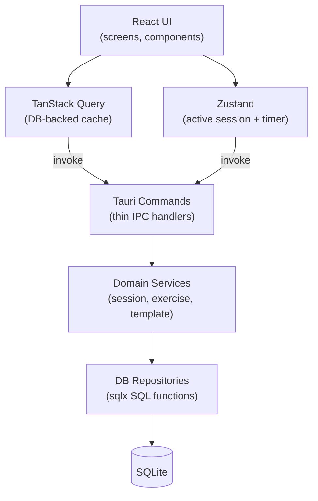
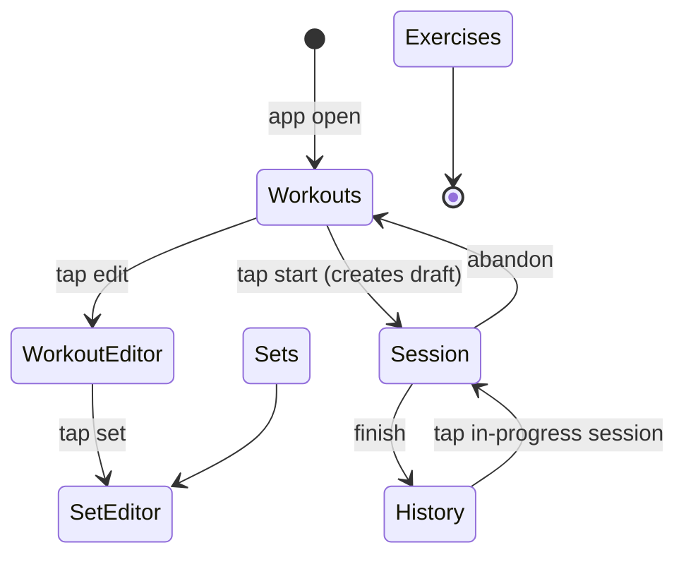

# dzerkout — Technical Architecture

**Version**: 1.0  
**Date**: 2026-04-22  
**Stack**: Tauri v2 · React · TypeScript · Vite · Rust · SQLite  
**Spec**: [SPEC.md](SPEC.md)

---

## 1. Architecture Overview

dzerkout is a three-layer local-first application. The React frontend handles
all rendering and user interaction. A Rust backend owns every database
operation, UUID generation, and domain-rule enforcement. SQLite is the single
source of truth.



**Why this design matches the spec:**

- All session transitions (snapshot, start, pause, resume, next, prev, skip,
  finish, abandon) are atomic DB writes owned by Rust. The frontend never
  derives new state — it receives the authoritative result of each command.
- Timer display is a pure derivation (`Date.now() - setStartedAt -
  paused_total_sec * 1000`) computed every render frame from DB-sourced base
  values in Zustand. Paused time never accumulates incorrectly.
- The two-layer state split (TanStack Query for persistent entity data; Zustand
  for live session state) keeps the active-runner responsive without
  complicating the rest of the app.

---

## 2. Runtime Model

| Concern | Runs in | Persisted immediately? |
|---|---|---|
| All UI rendering | React | — |
| Form state, search, modals | React local state | No |
| Exercise/template/history data | TanStack Query (fetches via Rust) | On mutation |
| Active session snapshot | Zustand (loaded from DB) | On every command |
| Timer display value | React (derived from Zustand base values) | Never persisted |
| Timer base values (started_at, paused_at, paused_total_sec) | Zustand | On Pause / Resume / Next set crossing |
| All SQL — snapshot, transitions, corrective Prev | Rust domain services | Yes, in transactions |
| UUID generation | Rust | Yes |
| Schema migrations | Rust (startup) | Yes |
| Platform detection (macOS vs Android) | React (`@tauri-apps/plugin-os`) | No |

**Nothing in React accumulates time independently.** The timer formula always
references `DB-sourced` base values. This means pause/resume, app backgrounding,
and recovery after a crash all produce the same correct display.

---

## 3. Module / Folder Structure

```
dzerkout/
├── src-tauri/
│   ├── Cargo.toml
│   ├── tauri.conf.json
│   ├── build.rs
│   ├── migrations/
│   │   ├── 001_initial_schema.sql
│   │   └── (future numbered files)
│   └── src/
│       ├── main.rs                   # Tauri app builder entry point
│       ├── lib.rs                    # Plugin + command registration
│       ├── error.rs                  # AppError enum, thiserror + serde
│       ├── db/
│       │   ├── mod.rs                # SqlitePool init, PRAGMA setup
│       │   ├── exercises.rs          # SQL functions for exercises
│       │   ├── set_templates.rs      # SQL functions for templates + cards
│       │   ├── workout_templates.rs  # SQL for templates, set refs, assignments
│       │   ├── sessions.rs           # SQL for sessions, sets, exercises
│       │   └── history.rs            # SQL for history queries
│       ├── domain/
│       │   ├── mod.rs
│       │   ├── types.rs              # Shared types: PlaceholderTag, SessionStatus
│       │   ├── exercise.rs           # Exercise service (unlink logic)
│       │   ├── set_template.rs       # SetTemplate service (clone, reorder)
│       │   ├── workout_template.rs   # WorkoutTemplate service (assignments)
│       │   └── session.rs            # Session service (snapshot, all transitions)
│       └── commands/
│           ├── mod.rs
│           ├── exercises.rs
│           ├── set_templates.rs
│           ├── workout_templates.rs
│           ├── sessions.rs
│           └── history.rs
│
├── src/
│   ├── main.tsx
│   ├── App.tsx                       # Shell: tab bar + RouterProvider
│   ├── router.tsx                    # createBrowserRouter config
│   ├── api/                          # Typed invoke() wrappers, one file per domain
│   │   ├── exercises.ts
│   │   ├── setTemplates.ts
│   │   ├── workoutTemplates.ts
│   │   └── sessions.ts
│   ├── store/
│   │   ├── sessionStore.ts           # Zustand: active session + timer base values
│   │   └── uiStore.ts                # Zustand: platform flag, global modal state
│   ├── hooks/
│   │   ├── useTimer.ts               # Derived elapsed ms from session store
│   │   ├── usePlatform.ts            # @tauri-apps/plugin-os: isAndroid
│   │   └── useSessionRecovery.ts     # On-mount draft / in-progress check
│   ├── screens/
│   │   ├── ExerciseLibrary/
│   │   │   ├── index.tsx
│   │   │   ├── ExerciseCard.tsx
│   │   │   └── ExerciseForm.tsx
│   │   ├── SetTemplateBuilder/
│   │   │   ├── index.tsx             # List view
│   │   │   ├── SetEditor.tsx         # Builder view
│   │   │   └── CardEditor.tsx        # Popover: edit card fields
│   │   ├── WorkoutTemplateBuilder/
│   │   │   ├── index.tsx             # List view (= SavedWorkouts)
│   │   │   ├── WorkoutEditor.tsx     # Builder view
│   │   │   └── AssignmentEditor.tsx  # Popover: workout-specific overrides
│   │   ├── ActiveWorkoutRunner/
│   │   │   ├── index.tsx
│   │   │   ├── TimerDisplay.tsx
│   │   │   ├── ExerciseQueue.tsx
│   │   │   └── RunnerControls.tsx
│   │   └── WorkoutHistory/
│   │       ├── index.tsx
│   │       └── SessionDetail.tsx
│   ├── components/
│   │   ├── SortableList/             # dnd-kit + Android button fallback
│   │   │   └── index.tsx
│   │   ├── ConfirmModal.tsx
│   │   └── ErrorBoundary.tsx
│   └── types/                        # TypeScript types mirroring Rust structs
│       ├── exercise.ts
│       ├── setTemplate.ts
│       ├── workoutTemplate.ts
│       └── session.ts
│
├── SPEC.md
├── ARCH.md
├── package.json
├── vite.config.ts
└── tsconfig.json
```

---

## 4. Frontend Architecture

### 4.1 Routing

```typescript
// router.tsx
const router = createBrowserRouter([
  { path: '/',                  element: <Navigate to="/workouts" /> },
  { path: '/exercises',         element: <ExerciseLibrary /> },
  { path: '/sets',              element: <SetTemplateBuilder /> },
  { path: '/sets/:id',          element: <SetEditor /> },
  { path: '/workouts',          element: <WorkoutTemplateBuilder /> },
  { path: '/workouts/:id',      element: <WorkoutEditor /> },
  { path: '/session',           element: <ActiveWorkoutRunner /> },
  { path: '/history',           element: <WorkoutHistory /> },
  { path: '/history/:sessionId',element: <SessionDetail /> },
]);
```

`App.tsx` renders a persistent tab bar (sidebar on desktop, bottom bar on
Android) and `<RouterProvider>`. The Active Session tab is conditionally
visible: `sessionStore.sessionId !== null`.

### 4.2 State Layering

**TanStack Query** manages all DB-backed read data — exercises, set templates,
workout templates, history. Every mutation calls a Rust command then invalidates
the relevant query key(s). No data is stored redundantly.

**Zustand `sessionStore`** manages active-session state. It is the only place
timer base values live in the frontend. It is loaded from the command return
value after every state-changing command; there is no partial update.

**Local component state** handles form fields (`react-hook-form`), search text,
modal visibility, and dnd-kit in-flight drag state.

### 4.3 Forms

Use `react-hook-form` with inline validation. Server-side domain errors
(`AppError::Conflict` for duplicate names, `AppError::Validation` for missing
required fields) are returned as typed JSON and merged into form error state via
`setError`. No custom validation framework is needed.

### 4.4 Drag-and-Drop Strategy

Desktop: `@dnd-kit/core` + `@dnd-kit/sortable`. The `SortableList` component
wraps a `DndContext` + `SortableContext`. On drag end, it calls `onReorder`
with the new ordered ID array, which maps to a Rust command (`reorder_cards` or
`reorder_set_refs`).

Android: `SortableList` detects `isAndroid` (from `uiStore`) and renders
up/down arrow buttons per item instead. Each button press calls `onReorder`
with a shifted array. No drag gesture is involved. The caller (builder screen)
passes a `renderFallbackControls` prop; the list is otherwise identical.

```tsx
// components/SortableList/index.tsx  (simplified)
export function SortableList<T extends { id: string }>({
  items, onReorder, renderItem, renderFallbackControls,
}: SortableListProps<T>) {
  const isAndroid = useUiStore(s => s.isAndroid);

  if (isAndroid) {
    return <>{items.map((item, i) => (
      <div key={item.id}>
        {renderItem(item)}
        {renderFallbackControls(item, i, items.length, onReorder)}
      </div>
    ))}</>;
  }

  return (
    <DndContext onDragEnd={e => handleDragEnd(e, items, onReorder)}>
      <SortableContext items={items.map(i => i.id)}>
        {items.map(item => (
          <SortableItem key={item.id} id={item.id}>
            {renderItem(item)}
          </SortableItem>
        ))}
      </SortableContext>
    </DndContext>
  );
}
```

This keeps both platforms served by one component tree with no parallel code
paths in builder screens.

### 4.5 Keyboard Shortcuts (desktop only)

Registered in `ActiveWorkoutRunner/index.tsx` behind `!isAndroid`:

```typescript
useEffect(() => {
  if (isAndroid) return;
  const onKey = (e: KeyboardEvent) => {
    if (e.key === 'ArrowRight') handleNext();
    if (e.key === 'ArrowLeft')  handlePrev();
    if (e.key === ' ')          handlePauseResume();
  };
  window.addEventListener('keydown', onKey);
  return () => window.removeEventListener('keydown', onKey);
}, [isAndroid]);
```

---

## 5. Rust Backend Architecture

### 5.1 Command Layer (thin)

Commands in `commands/*.rs` do three things only:
1. Deserialize input from Tauri IPC.
2. Call the appropriate domain service function.
3. Return the result or `AppError`.

No SQL, no business logic, no UUID generation in command handlers.

### 5.2 Command Inventory

**exercises.rs**
- `list_exercises() → Vec<Exercise>`
- `create_exercise(name, notes) → Exercise`
- `update_exercise(id, name, notes) → Exercise`
- `get_exercise_references(id) → ExerciseReferences`
- `delete_exercise(id, confirmed: bool) → ()`

**set_templates.rs**
- `list_set_templates() → Vec<SetTemplateSummary>`
- `get_set_template(id) → SetTemplateDetail`
- `create_set_template(name, notes) → SetTemplate`
- `update_set_template(id, name, notes) → SetTemplate`
- `delete_set_template(id) → ()`
- `clone_set_template(id) → SetTemplate`
- `add_card(set_id, card_type, exercise_id?, placeholder_tag?, placeholder_label?, duration_hint_sec?, notes?) → SetTemplateCard`
- `update_card(card_id, ...) → SetTemplateCard`
- `remove_card(card_id) → ()`
- `reorder_cards(set_id, ordered_ids: Vec<String>) → ()`

**workout_templates.rs**
- `list_workout_templates() → Vec<WorkoutTemplateSummary>`
- `get_workout_template(id) → WorkoutTemplateDetail`
- `create_workout_template(name, notes, default_duration_sec, rest_sec?) → WorkoutTemplate`
- `update_workout_template(id, ...) → WorkoutTemplate`
- `delete_workout_template(id) → ()`
- `add_set_ref(workout_id, set_id) → WorkoutTemplateSetRef`
- `remove_set_ref(set_ref_id) → ()`
- `reorder_set_refs(workout_id, ordered_ids: Vec<String>) → ()`
- `clone_set_from_workout(set_ref_id) → WorkoutTemplateSetRef`
- `upsert_card_assignment(set_ref_id, card_id, exercise_id?, display_label?, duration_hint_sec?, notes?) → WorkoutTemplateCardAssignment`
- `delete_card_assignment(assignment_id) → ()`

**sessions.rs**
- `get_active_session() → Option<ActiveSessionPayload>`
- `create_session_draft(workout_template_id) → ActiveSessionPayload`
- `start_session(session_id) → ActiveSessionPayload`
- `pause_session(session_id, set_id) → ActiveSessionPayload`
- `resume_session(session_id, set_id) → ActiveSessionPayload`
- `advance_exercise(session_id) → ActiveSessionPayload`
- `retreat_exercise(session_id) → ActiveSessionPayload`
- `skip_exercise(session_id, exercise_id) → ActiveSessionPayload`
- `finish_session(session_id) → WorkoutSession`
- `abandon_session(session_id) → ()`
- `discard_session(session_id) → ()`

**history.rs**
- `list_session_history() → Vec<SessionSummary>`
- `get_session_detail(session_id) → SessionDetail`

### 5.3 Domain Service Layer

`domain/session.rs` is the most complex service. It owns:
- Snapshot creation: the full fallback chain resolving `exercise_id`,
  `display_name`, `duration_hint_sec`, and `notes` from assignments and cards.
- All state transitions: start, pause, resume, advance, retreat, skip,
  finish, abandon.
- Corrective-Prev semantics: within-set and cross-set cases as specified in the
  spec.
- The implicit-resume rule: if `paused_at` is non-null when `advance`,
  `retreat`, `skip`, or `finish` is called, it performs the resume transaction
  first.

`domain/exercise.rs` owns the deletion-with-unlink transaction, handling all
three reference types (`SetTemplateCard`, `WorkoutTemplateCardAssignment`,
`WorkoutSessionExercise`) in a single atomic operation.

`domain/workout_template.rs` owns the `clone_set_from_workout` logic and
validates card counts for startability (at least one concrete or placeholder
card across all non-empty sets).

### 5.4 Error Type

```rust
#[derive(Debug, thiserror::Error, serde::Serialize)]
#[serde(tag = "type", content = "message")]
pub enum AppError {
    #[error("Not found: {0}")]
    NotFound(String),
    #[error("Validation: {0}")]
    Validation(String),
    #[error("Conflict: {0}")]
    Conflict(String),
    #[error("No active session")]
    NoActiveSession,
    #[error("Database error")]
    Database(#[from] sqlx::Error),
}
impl tauri::ipc::IntoIpcResponse for AppError { ... }
```

Frontend maps the `type` discriminant to typed error handling. `Conflict`
surfaces as an inline form error. `Database` surfaces as a global error modal.

### 5.5 `ActiveSessionPayload` Pattern

Commands that drive the runner return a complete `ActiveSessionPayload` struct
rather than requiring the frontend to refetch:

```rust
pub struct ActiveSessionPayload {
    pub session:             WorkoutSession,
    pub sets:                Vec<WorkoutSessionSet>,
    pub exercises:           Vec<WorkoutSessionExercise>,
    pub current_exercise_id: Option<String>,
    pub current_set_id:      Option<String>,
    /// DB-sourced timer base values for the current set.
    /// Zustand derives elapsed time from these; nothing is accumulated in the frontend.
    pub timer_base:          TimerBase,
}
```

The frontend loads this payload wholesale into `sessionStore` after every
command. No partial-update logic is needed anywhere.

---

## 6. Persistence Architecture

### 6.1 Connection Management

Use `sqlx::SqlitePool` with `max_connections = 2`. Store in Tauri managed
state via `app.manage(pool)`. The DB file path is resolved at runtime using
`app.path().app_data_dir()`, which works correctly on both macOS and Android.
Connection strings follow the pattern:
`sqlite://{app_data_dir}/dzerkout.db?mode=rwc`.

### 6.2 Startup Configuration

Run once, before the Tauri app window opens:

```rust
sqlx::migrate!("migrations/").run(&pool).await?;
sqlx::query("PRAGMA foreign_keys = ON").execute(&pool).await?;
sqlx::query("PRAGMA journal_mode = WAL").execute(&pool).await?;
sqlx::query("PRAGMA synchronous = NORMAL").execute(&pool).await?;
```

WAL mode allows reads while writes proceed and avoids locking on the single
pool. `foreign_keys = ON` is required per the spec; enforce on every connection
via an `after_connect` hook on the pool, not just at startup.

### 6.3 Migration Files

`migrations/001_initial_schema.sql` creates all tables from the spec in one
file. Future migrations are numbered sequentially and additive only. The file
name convention is `{NNN}_{description}.sql`.

Key schema decisions directly from the spec:
- All PKs are `TEXT` (UUID stored as string).
- `updated_at` is managed by per-table `AFTER UPDATE` triggers.
- `WorkoutSession.status` is `TEXT` constrained to the four lifecycle values.
- `WorkoutSessionSet.paused_total_sec` is `INTEGER NOT NULL DEFAULT 0`.

### 6.4 Atomic Session Snapshot

The `create_session_draft` domain function wraps the entire operation in one
`sqlx::Transaction`:

```rust
pub async fn create_session_draft(
    pool: &SqlitePool,
    workout_template_id: &str,
) -> Result<ActiveSessionPayload, AppError> {
    let mut tx = pool.begin().await?;
    let session = db::sessions::insert_session(&mut tx, ...).await?;
    for set_ref in non_empty_set_refs(&mut tx, workout_template_id).await? {
        let sess_set = db::sessions::insert_session_set(&mut tx, &session.id, &set_ref).await?;
        for card in set_ref.cards {
            let resolved = resolve_card(&card, &assignments);
            db::sessions::insert_exercise(&mut tx, &sess_set.id, &resolved).await?;
        }
    }
    tx.commit().await?;
    // load and return full payload
}
```

If any insert fails, the entire transaction rolls back. The frontend either
gets a complete draft or an error — never a partial session.

### 6.5 Pause / Resume Persistence

**Pause** — single UPDATE, committed immediately:
```sql
UPDATE workout_session_sets
SET paused_at = strftime('%Y-%m-%dT%H:%M:%fZ', 'now')
WHERE id = ?
```

**Resume** — single UPDATE that accumulates elapsed pause time atomically:
```sql
UPDATE workout_session_sets
SET paused_total_sec = paused_total_sec
                     + (unixepoch('now') - unixepoch(paused_at)),
    paused_at = NULL
WHERE id = ?
```

Both return a full `ActiveSessionPayload` to the frontend.

### 6.6 Corrective Prev Persistence

All Prev mutations run in a single transaction.

Within the same set:
```sql
UPDATE workout_session_exercises
SET started_at = NULL, ended_at = NULL, status = 'pending'
WHERE id = ?;  -- current exercise

UPDATE workout_session_exercises
SET ended_at = NULL, started_at = strftime('%Y-%m-%dT%H:%M:%fZ', 'now'), status = 'active'
WHERE id = ?;  -- previous exercise
```

Crossing a set boundary (additional updates):
```sql
UPDATE workout_session_sets
SET started_at = NULL, ended_at = NULL, paused_at = NULL, paused_total_sec = 0
WHERE id = ?;  -- current set

UPDATE workout_session_sets
SET ended_at = NULL, started_at = strftime('%Y-%m-%dT%H:%M:%fZ', 'now'),
    paused_at = NULL, paused_total_sec = 0
WHERE id = ?;  -- previous set
```

---

## 7. State Management Plan

### 7.1 Zustand `sessionStore`

```typescript
interface SessionStore {
  // Session identity and status
  sessionId:   string | null;
  sessionStatus: 'draft' | 'in_progress' | 'completed' | 'abandoned' | null;

  // Full snapshot (loaded once, refreshed on every command response)
  sets:      WorkoutSessionSet[];
  exercises: WorkoutSessionExercise[];

  // Navigation cursors
  currentSetId:      string | null;
  currentExerciseId: string | null;

  // Timer base values (sourced from the current WorkoutSessionSet)
  setStartedAt:   number | null;  // Unix ms
  pausedTotalSec: number;         // seconds
  pausedAt:       number | null;  // Unix ms; non-null = currently paused

  // Actions
  load(payload: ActiveSessionPayload): void;
  clear(): void;
}
```

`load()` is the only write path into `sessionStore` from the runner. Every
Rust command that drives the runner returns an `ActiveSessionPayload`; the
frontend calls `load(payload)` and the store updates atomically from that
authoritative result. There is no partial-patch logic.

### 7.2 Timer Derivation

```typescript
// hooks/useTimer.ts
export function useElapsedMs(): number {
  const { setStartedAt, pausedTotalSec, pausedAt, sessionStatus } = useSessionStore();
  const [tick, setTick] = useState(0);

  useEffect(() => {
    // Only tick when actively running
    if (!setStartedAt || pausedAt !== null || sessionStatus !== 'in_progress') return;
    const id = setInterval(() => setTick(t => t + 1), 100);
    return () => clearInterval(id);
  }, [setStartedAt, pausedAt, sessionStatus]);

  if (!setStartedAt) return 0;
  const wall = pausedAt !== null ? pausedAt : Date.now();
  return Math.max(0, wall - setStartedAt - pausedTotalSec * 1000);
}
```

`tick` is only used to trigger re-renders; the actual value always recomputes
from the DB-sourced base values. The timer cannot drift independently of the
persisted state.

### 7.3 TanStack Query Keys

```
['exercises']
['set-templates']
['set-template', id]
['workout-templates']
['workout-template', id]
['session-history']
['session-detail', sessionId]
```

Mutations invalidate the minimal affected key(s). No query in this app is
complex enough to warrant `select` transforms or normalisation — raw entity
arrays returned by Rust are sufficient.

---

## 8. Navigation / Screen Composition



The shell `App.tsx` renders the tab bar plus a `<SessionRecoveryGate>` that
checks for an existing draft/in-progress session on mount and shows the
appropriate Continue/Resume modal before the UI becomes interactive.

The `/session` route is accessible from the tab bar whenever `sessionId !== null`.
Navigating away from it does not pause the session; the timer continues via the
Zustand store and the `setInterval` in `useElapsedMs`.

---

## 9. Session and Timer Orchestration

```mermaid
sequenceDiagram
    participant U as User
    participant R as React
    participant Z as Zustand
    participant T as Rust
    participant D as SQLite

    U->>R: tap Start on workout template
    R->>T: create_session_draft(workout_template_id)
    T->>D: BEGIN; INSERT session(draft)+sets+exercises; COMMIT
    T-->>R: ActiveSessionPayload
    R->>Z: load(payload)  [sessionStatus=draft, setStartedAt=null]
    R->>R: navigate /session  [pre-start state, timer frozen at 0]

    U->>R: press Start
    R->>T: start_session(session_id)
    T->>D: UPDATE session→in_progress; UPDATE first set started_at; UPDATE first exercise→active
    T-->>R: ActiveSessionPayload
    R->>Z: load(payload)  [setStartedAt=now, pausedAt=null]
    Note over R,Z: setInterval starts; elapsed = Date.now()-setStartedAt

    U->>R: press Pause
    R->>T: pause_session(session_id, set_id)
    T->>D: UPDATE set paused_at=now
    T-->>R: ActiveSessionPayload
    R->>Z: load(payload)  [pausedAt=now]
    Note over R,Z: interval clears; display freezes

    U->>R: press Resume
    R->>T: resume_session(session_id, set_id)
    T->>D: UPDATE set paused_total_sec+=Δ, paused_at=NULL
    T-->>R: ActiveSessionPayload
    R->>Z: load(payload)  [pausedAt=null, paused_total_sec updated]
    Note over R,Z: interval restarts

    U->>R: press Next (crossing set boundary)
    R->>T: advance_exercise(session_id)
    T->>D: UPDATE old exercise→completed; UPDATE old set ended_at; UPDATE new set started_at; UPDATE new exercise→active
    T-->>R: ActiveSessionPayload
    R->>Z: load(payload)  [new setStartedAt, pausedTotalSec=0]
    Note over R,Z: timer resets to 0

    U->>R: press Prev (crossing set boundary)
    R->>T: retreat_exercise(session_id)
    T->>D: Corrective rewrite in one transaction (see §6.6)
    T-->>R: ActiveSessionPayload
    R->>Z: load(payload)  [prev set's new started_at]
    Note over R,Z: timer resets to 0

    U->>R: press Finish
    R->>T: finish_session(session_id)
    T->>D: UPDATE session→completed; set + exercise ended_at
    T-->>R: WorkoutSession
    R->>Z: clear()
    R->>R: navigate /history; invalidate ['session-history']
```

### Recovery after app restart

`useSessionRecovery` runs inside `App.tsx` before any tab content renders:

```typescript
// hooks/useSessionRecovery.ts
export function useSessionRecovery() {
  useEffect(() => {
    sessionsApi.getActiveSession().then(payload => {
      if (!payload) return;

      const isDraft = payload.session.status === 'draft';
      const label   = isDraft ? 'Continue' : 'Resume';

      showConfirmModal({
        message: isDraft
          ? 'You have an unstarted workout. Continue?'
          : 'You have a workout in progress. Resume?',
        confirmLabel: label,
        onConfirm: () => {
          sessionStore.load(payload);
          navigate('/session');
        },
        onCancel: () => sessionsApi.discardSession(payload.session.id),
      });
    });
  }, []);
}
```

When the payload has `paused_at !== null` (app closed while paused), `load()`
sets `pausedAt` in the store; `useElapsedMs` returns the frozen value and the
timer does not tick until the user presses Resume.

---

## 10. Desktop vs Android Interaction Strategy

| Feature | macOS | Android |
|---|---|---|
| Card/set reordering | dnd-kit drag | Up/down arrow buttons |
| Runner navigation | Keyboard: `→` / `←` / `Space` | Touch buttons only |
| Background timer | Window notification badge | Android foreground service |
| App shell layout | Sidebar tabs | Bottom tab bar |

### Android Foreground Service

The spec requires a foreground service to prevent Android from killing an
in-progress session. This is the only platform-native code in the project.
Implement it as a minimal Kotlin file in
`src-tauri/gen/android/app/src/main/kotlin/` that:

1. Exposes a `startForegroundTimer(sessionName: String)` and
   `stopForegroundTimer()` function.
2. Shows a persistent notification with the session name.
3. Tapping the notification launches the app and navigates to `/session`.

Wire to two Tauri commands: `start_foreground_notification(name)` and
`stop_foreground_notification()`. Call them from the frontend on session start
and finish/abandon. No foreground service is needed on macOS; gate the calls
behind `isAndroid`.

---

## 11. Error Handling and Recovery

### Rust errors

`AppError` variants map to different frontend treatments:

| Variant | Frontend treatment |
|---|---|
| `Conflict` | Inline form error via `setError` |
| `Validation` | Inline form error |
| `NotFound` | Toast notification; refresh query |
| `NoActiveSession` | Clear session store; navigate to /workouts |
| `Database` | Global error boundary modal: "Something went wrong. Please restart." |

All Rust commands return `Result<T, AppError>`. The `api/` wrappers parse the
`type` discriminant and throw typed TypeScript errors that callers can switch on.

### Frontend boundary

`ErrorBoundary.tsx` wraps the router. Unhandled promise rejections from
`Database` errors reach it and show the restart modal. All other errors are
handled locally at the mutation/query site.

No retry logic is needed; operations are idempotent at the SQLite level
(inserts use `INSERT OR IGNORE` where appropriate for idempotent snapshot
recreation) and the app is always offline-local.

---

## 12. Testing Strategy

### Rust: domain unit tests

In `domain/*.rs`, `#[cfg(test)]` blocks cover pure logic:

- Exercise unlink: verify all three reference types are handled; verify
  `placeholder_label` and `display_label` fallback behavior.
- Snapshot resolution: verify `display_name`, `duration_hint_sec`, `notes`
  fallback chains for all combinations of assignment presence/absence.
- Pause accumulation arithmetic.

### Rust: DB integration tests

Use `sqlx::test` which spins up a real in-memory SQLite per test with
migrations applied. One test per critical state transition:

1. `create_session_draft` with mixed empty/non-empty sets — verify empty sets
   produce no `WorkoutSessionSet` rows.
2. `start_session` — verify `started_at`, `session_date`, `status`.
3. `advance_exercise` within same set — verify timer continuity (set
   `started_at` unchanged).
4. `advance_exercise` crossing set boundary — verify set `ended_at` / new set
   `started_at`.
5. `retreat_exercise` within same set — verify corrective rewrite.
6. `retreat_exercise` crossing set boundary — verify full corrective rewrite
   including pause fields.
7. `pause_session` / `resume_session` round-trip — verify `paused_total_sec`
   accumulates correctly.
8. `finish_session` — verify status, all `ended_at` fields.
9. `delete_exercise` with references — verify all three reference types handled
   correctly.

### Frontend: unit tests (Vitest)

- `useElapsedMs`: mock `Date.now()`; test active, paused, and restarted-after-
  Prev states. Pure computation; no component needed.
- `SortableList`: verify dnd-kit renders on desktop (mock `isAndroid = false`);
  verify arrow buttons render on Android (mock `isAndroid = true`).

### Frontend: component tests (React Testing Library)

Smoke tests for list render, empty state, and form submission per screen. Mock
the `api/` layer (not Tauri internals). Cover: ExerciseLibrary CRUD flow,
SetTemplateBuilder card add/remove, WorkoutHistory list render.

### E2E scenarios (Tauri WebDriver / WebdriverIO)

Four critical happy paths:

1. **Full workout:** create exercise → set template → workout template → start
   session → finish → verify session in history with correct exercise names.
2. **Pause recovery:** start session → pause → kill app → reopen → verify timer
   shows frozen value → press Resume → verify timer restarts correctly.
3. **Prev corrective rewrite:** start session → advance to set 2 → press Prev
   → verify timer reset to 0 and previous set's exercise is active.
4. **Skip persistence:** start session → skip all exercises → finish → verify
   history shows all exercises with skipped status.

---

## 13. Risks / Tradeoffs

| Risk | Severity | Mitigation |
|---|---|---|
| Timer drift if `Date.now()` skews after relaunch | Low | Base values are from DB timestamps; drift only affects sub-second display jitter |
| Android foreground service Kotlin boilerplate | Medium | Minimal v1 scope: notification only, no audio or scheduling |
| `dnd-kit` touch-drag on Android (if attempted later) | Low | Explicitly disabled in v1; arrow-button path is isolated in `SortableList` |
| `sqlx` `DATABASE_URL` required at compile time for query macros | Low | Use `DATABASE_URL` env var pointing to dev DB; CI sets it in the workflow; alternatively use `query!` with `offline` mode |
| Assignment editor UX complexity (nested override per card per workout) | Medium | Keep `AssignmentEditor` as a simple popover with nullable fields; unset = no override |
| `ActiveSessionPayload` size for long workouts | Negligible | Single-user SQLite; a 60-exercise session is ~5 KB |

### V1 simplifications accepted

- No optimistic UI updates. Local SQLite commands return in < 10ms; waiting for
  the response before updating state is invisible to the user and removes an
  entire category of consistency bugs.
- No undo/redo stack. Prev is the only corrective action and it is fully
  specified.
- Android foreground service is notification-only in v1; no lock-screen widget
  or background audio.

### Safely deferred (schema already supports)

- Muscle-group tagging: `placeholder_tag` + `exercise_id` FK are already stored
  in session exercises.
- Rest timer UI: `rest_between_sets_sec` is stored; no schema change needed.
- Image upload: `image_url` column exists; UI field is disabled.
- Ad-hoc sessions: `workout_template_id` is nullable.
- Sync layer: UUID PKs + `created_at` / `updated_at` on every row; a
  `sync_id` column and a sync service can be added without touching any
  existing query.

---

## 14. Recommended Implementation Order

### Phase 1 — Foundation (days 1–2)
1. Tauri v2 scaffold: `src-tauri/` + `src/` structure, Vite config, TypeScript config.
2. `SqlitePool` initialization, WAL + FK pragmas, `sqlx::migrate!` runner.
3. `migrations/001_initial_schema.sql` — all tables from the spec in one file.
4. `AppError` type + `tauri::ipc::IntoIpcResponse` impl.
5. Command registration skeleton (`lib.rs`).

### Phase 2 — Data layer (days 3–5)
6. Exercise CRUD commands + domain service (with unlink logic and all three
   reference-type handling).
7. SetTemplate CRUD + card management + clone command.
8. WorkoutTemplate CRUD + set refs + card assignments + `upsert_card_assignment`.
9. React screens: ExerciseLibrary, SetTemplateBuilder, WorkoutTemplateBuilder
   (read + write, no drag yet).
10. TanStack Query setup + typed `api/` wrappers.

### Phase 3 — Session core (days 6–9)
11. `create_session_draft` — atomic snapshot with full fallback chains.
12. `start_session`, `finish_session`, `abandon_session`, `discard_session`.
13. `advance_exercise`, `retreat_exercise` (including corrective Prev and
    cross-set cases).
14. `skip_exercise`.
15. `pause_session`, `resume_session`.
16. `get_active_session`.
17. Zustand `sessionStore` + `useTimer` hook.
18. `ActiveWorkoutRunner` screen (timer display, exercise queue, all controls).
19. `useSessionRecovery` hook + recovery gate in `App.tsx`.

### Phase 4 — Platform polish (days 10–12)
20. `SortableList` with dnd-kit on desktop.
21. Android up/down button fallback in `SortableList`.
22. Keyboard shortcuts in `ActiveWorkoutRunner` (desktop only).
23. Android foreground service Kotlin shim + Tauri commands.
24. `WorkoutHistory` screen + `SessionDetail`.

### Phase 5 — Testing and hardening (days 13–14)
25. Rust `sqlx::test` integration tests for all 9 DB scenarios.
26. Rust unit tests for domain logic (unlink, snapshot fallback, pause arithmetic).
27. `useElapsedMs` unit tests with mocked `Date.now()`.
28. 4 critical E2E scenarios with WebdriverIO.
