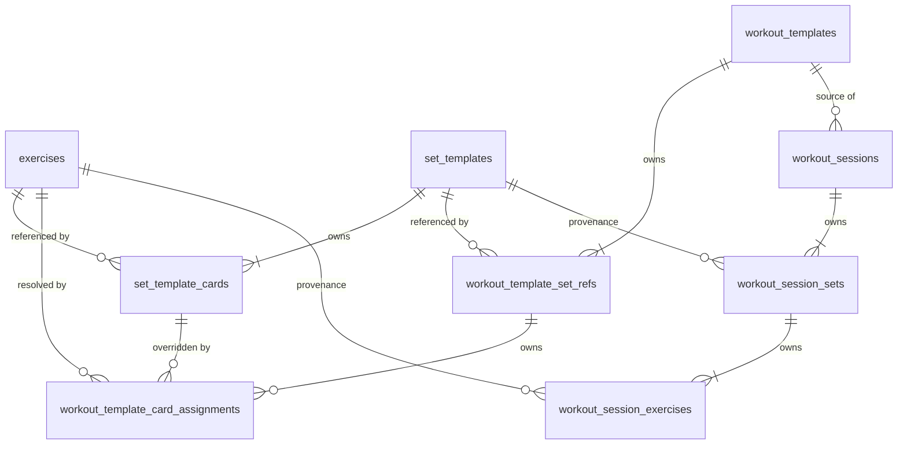

# dzerkout — Persistence Design

**Version**: 1.0  
**Date**: 2026-04-22  
**Inputs**: [SPEC.md](SPEC.md) · [ARCH.md](ARCH.md)  
**Stack**: SQLite · Rust · sqlx (direct SQL, no ORM)

---

## 1. Schema Overview

### Relational model



### Two-layer split

**Template layer** (`exercises`, `set_templates`, `set_template_cards`,
`workout_templates`, `workout_template_set_refs`,
`workout_template_card_assignments`) — reusable, mutable, never directly
executed. Changes here do not affect sessions already snapshotted.

**Session layer** (`workout_sessions`, `workout_session_sets`,
`workout_session_exercises`) — immutable historical record of what was actually
performed. Created atomically at snapshot time; the only mutations are status
transitions and corrective Prev rewrites.

### Where denormalization occurs and why

| Denormalized column | Location | Reason |
|---|---|---|
| `display_name` | `workout_session_exercises` | Exercise may be renamed or deleted; history must be stable |
| `source_workout_template_name` | `workout_sessions` | Template may be renamed; history must show original name |
| `duration_hint_sec` | `workout_session_exercises` | Records the value actually used, after assignment override resolution |
| `notes` | `workout_session_exercises` | Records the notes from assignment or card at snapshot time |
| `placeholder_tag` | `workout_session_exercises` | Preserved for future analytics; the template card may change |

### How workout-specific overrides fit

`workout_template_card_assignments` sits between the template layer and the
session layer. It holds per-workout-per-card overrides (resolved exercise,
label, duration hint, notes). During snapshot creation the service applies the
assignment fallback chain to produce the denormalized session values. The
assignment rows themselves remain in the template layer and are never copied
into sessions.

---

## 2. Representation Choices

### UUIDs — `TEXT`, lowercase, hyphenated

Store as `TEXT` in the form `xxxxxxxx-xxxx-xxxx-xxxx-xxxxxxxxxxxx`.

**Rationale:** Readable in any SQLite browser; sqlx maps directly to/from
`uuid::Uuid` via `sqlx::types::Uuid` with the `uuid` feature; no byte-order
ambiguity; negligible size difference for a single-user local app.

In Rust, generate all UUIDs with `uuid::Uuid::new_v4().to_string()` in the
domain/service layer before inserting.

### Timestamps — `TEXT`, ISO 8601 UTC

Store as `TEXT` in the form `YYYY-MM-DDTHH:MM:SS.SSSZ`
(e.g. `2026-04-22T14:30:00.000Z`).

SQLite default expression: `strftime('%Y-%m-%dT%H:%M:%fZ', 'now')`

**Rationale:** Compatible with SQLite's built-in `unixepoch()`, `datetime()`,
and `strftime()` functions, which are used in the pause/resume UPDATE. Maps to
`chrono::DateTime<Utc>` in sqlx. Readable in DB browsers.

### Dates — `TEXT`, `YYYY-MM-DD`

Used for `workout_sessions.session_date`. SQLite default expression:
`strftime('%Y-%m-%d', 'now')`.

Maps to `chrono::NaiveDate` in sqlx.

### Enum-like fields — `TEXT` + `CHECK`

Use `TEXT NOT NULL` with `CHECK` constraints. This gives DB-level enforcement
for a small fixed vocabulary without a lookup table, while remaining relaxable
in a future migration.

---

## 3. Final Table Definitions

### 3.1 `exercises`

Stores all exercises available to the user.

```sql
CREATE TABLE exercises (
    id          TEXT NOT NULL PRIMARY KEY,
    name        TEXT NOT NULL,
    notes       TEXT,
    image_url   TEXT,                   -- reserved; not surfaced in v1 UI
    created_at  TEXT NOT NULL DEFAULT (strftime('%Y-%m-%dT%H:%M:%fZ', 'now')),
    updated_at  TEXT NOT NULL DEFAULT (strftime('%Y-%m-%dT%H:%M:%fZ', 'now'))
);

CREATE UNIQUE INDEX uq_exercises_name ON exercises (name);
```

**Constraints:** `name` uniqueness enforced by index. No FK dependencies.

---

### 3.2 `set_templates`

Reusable named sets. Owns cards via `set_template_cards`.

```sql
CREATE TABLE set_templates (
    id          TEXT NOT NULL PRIMARY KEY,
    name        TEXT NOT NULL,
    notes       TEXT,
    created_at  TEXT NOT NULL DEFAULT (strftime('%Y-%m-%dT%H:%M:%fZ', 'now')),
    updated_at  TEXT NOT NULL DEFAULT (strftime('%Y-%m-%dT%H:%M:%fZ', 'now'))
);
```

---

### 3.3 `set_template_cards`

Ordered cards within a set template. Each card is either `concrete`
(references an exercise) or `placeholder` (carries a tag).

```sql
CREATE TABLE set_template_cards (
    id                  TEXT NOT NULL PRIMARY KEY,
    set_template_id     TEXT NOT NULL
                            REFERENCES set_templates(id) ON DELETE CASCADE,
    card_type           TEXT NOT NULL
                            CHECK (card_type IN ('concrete', 'placeholder')),
    order_index         INTEGER NOT NULL,
    duration_hint_sec   INTEGER,
    notes               TEXT,
    -- concrete fields
    exercise_id         TEXT
                            REFERENCES exercises(id) ON DELETE RESTRICT,
    -- placeholder fields
    placeholder_tag     TEXT
                            CHECK (placeholder_tag IN (
                                'unspecified','push','pull','legs','core','mobility'
                            )),
    placeholder_label   TEXT,
    created_at          TEXT NOT NULL DEFAULT (strftime('%Y-%m-%dT%H:%M:%fZ', 'now')),
    updated_at          TEXT NOT NULL DEFAULT (strftime('%Y-%m-%dT%H:%M:%fZ', 'now')),

    -- enforce card type invariants
    CHECK (
        (card_type = 'concrete'
            AND exercise_id IS NOT NULL
            AND placeholder_tag IS NULL
            AND placeholder_label IS NULL)
        OR
        (card_type = 'placeholder'
            AND placeholder_tag IS NOT NULL
            AND exercise_id IS NULL)
    )
);

CREATE UNIQUE INDEX uq_stc_set_order ON set_template_cards (set_template_id, order_index);
```

**FK notes:**
- `set_template_id CASCADE`: cards are owned by their set; deleting a set
  deletes all its cards.
- `exercise_id RESTRICT`: prevents exercise deletion while card references
  exist. The service converts all referencing cards to placeholders within the
  deletion transaction before the DELETE fires (see §7).

---

### 3.4 `workout_templates`

Named reusable workouts. Owns set references and per-card assignments.

```sql
CREATE TABLE workout_templates (
    id                          TEXT NOT NULL PRIMARY KEY,
    name                        TEXT NOT NULL,
    notes                       TEXT,
    default_exercise_duration_sec INTEGER NOT NULL DEFAULT 120
                                    CHECK (default_exercise_duration_sec > 0),
    rest_between_sets_sec       INTEGER
                                    CHECK (rest_between_sets_sec IS NULL
                                        OR rest_between_sets_sec >= 0),
    created_at  TEXT NOT NULL DEFAULT (strftime('%Y-%m-%dT%H:%M:%fZ', 'now')),
    updated_at  TEXT NOT NULL DEFAULT (strftime('%Y-%m-%dT%H:%M:%fZ', 'now'))
);
```

---

### 3.5 `workout_template_set_refs`

Ordered references from a workout template to set templates. The same set
template may appear multiple times.

```sql
CREATE TABLE workout_template_set_refs (
    id                  TEXT NOT NULL PRIMARY KEY,
    workout_template_id TEXT NOT NULL
                            REFERENCES workout_templates(id) ON DELETE CASCADE,
    set_template_id     TEXT NOT NULL
                            REFERENCES set_templates(id) ON DELETE RESTRICT,
    order_index         INTEGER NOT NULL,
    created_at  TEXT NOT NULL DEFAULT (strftime('%Y-%m-%dT%H:%M:%fZ', 'now')),
    updated_at  TEXT NOT NULL DEFAULT (strftime('%Y-%m-%dT%H:%M:%fZ', 'now'))
);

CREATE UNIQUE INDEX uq_wtsr_workout_order
    ON workout_template_set_refs (workout_template_id, order_index);
```

**FK notes:**
- `workout_template_id CASCADE`: set refs owned by the workout template.
- `set_template_id RESTRICT`: prevents deleting a set template that is
  still referenced. Service must warn the user and obtain confirmation before
  removing refs and then deleting.

---

### 3.6 `workout_template_card_assignments`

Workout-specific overrides for individual cards within a set reference.
At most one row per `(workout_template_set_ref_id, set_template_card_id)`.

```sql
CREATE TABLE workout_template_card_assignments (
    id                          TEXT NOT NULL PRIMARY KEY,
    workout_template_set_ref_id TEXT NOT NULL
                                    REFERENCES workout_template_set_refs(id)
                                    ON DELETE CASCADE,
    set_template_card_id        TEXT NOT NULL
                                    REFERENCES set_template_cards(id)
                                    ON DELETE CASCADE,
    exercise_id                 TEXT
                                    REFERENCES exercises(id) ON DELETE RESTRICT,
    display_label               TEXT,
    duration_hint_sec           INTEGER,
    notes                       TEXT,
    created_at  TEXT NOT NULL DEFAULT (strftime('%Y-%m-%dT%H:%M:%fZ', 'now')),
    updated_at  TEXT NOT NULL DEFAULT (strftime('%Y-%m-%dT%H:%M:%fZ', 'now')),

    UNIQUE (workout_template_set_ref_id, set_template_card_id)
);
```

The `UNIQUE` constraint on `(workout_template_set_ref_id, set_template_card_id)`
is the backing index for uniqueness enforcement and assignment lookup;
no separate `CREATE INDEX` is needed.

**FK notes:**
- Both parent FKs use `CASCADE`: if the set ref or the source card is
  removed, the assignment is gone.
- `exercise_id RESTRICT`: service handles nulling before exercise delete.
- **Cross-set integrity (service layer):** SQLite cannot enforce with a simple
  FK that the referenced `set_template_card_id` belongs to the `set_template_id`
  that `workout_template_set_ref_id` points to. The service validates this
  explicitly before every insert/upsert (see §9.9).

---

### 3.7 `workout_sessions`

One row per workout attempt. Lifecycle: `draft` → `in_progress` →
`completed | abandoned`.

```sql
CREATE TABLE workout_sessions (
    id                          TEXT NOT NULL PRIMARY KEY,
    workout_template_id         TEXT
                                    REFERENCES workout_templates(id)
                                    ON DELETE SET NULL,
    source_workout_template_name TEXT,   -- denormalized at snapshot time
    status                      TEXT NOT NULL DEFAULT 'draft'
                                    CHECK (status IN (
                                        'draft','in_progress','completed','abandoned'
                                    )),
    session_date                TEXT,    -- YYYY-MM-DD; null until Start pressed
    started_at                  TEXT,    -- null until Start pressed
    ended_at                    TEXT,    -- null until completed or abandoned
    notes                       TEXT,
    created_at  TEXT NOT NULL DEFAULT (strftime('%Y-%m-%dT%H:%M:%fZ', 'now')),
    updated_at  TEXT NOT NULL DEFAULT (strftime('%Y-%m-%dT%H:%M:%fZ', 'now'))
);

-- fast lookup for active-session check on app launch
CREATE INDEX idx_ws_status ON workout_sessions (status)
    WHERE status IN ('draft', 'in_progress');

-- reverse-chronological history listing
CREATE INDEX idx_ws_history ON workout_sessions (session_date DESC, started_at DESC)
    WHERE status = 'completed';
```

**FK notes:**
- `workout_template_id SET NULL`: sessions are historical records. If the
  source template is deleted, the session remains with a null FK but retains
  `source_workout_template_name`.

---

### 3.8 `workout_session_sets`

Snapshot of one set as performed. One row per non-empty set reference in the
snapshot. Owns the set timer state.

```sql
CREATE TABLE workout_session_sets (
    id                      TEXT NOT NULL PRIMARY KEY,
    workout_session_id      TEXT NOT NULL
                                REFERENCES workout_sessions(id) ON DELETE CASCADE,
    source_set_template_id  TEXT
                                REFERENCES set_templates(id) ON DELETE SET NULL,
    order_index             INTEGER NOT NULL,
    started_at              TEXT,       -- set at Phase 2 start or corrective Prev reset
    ended_at                TEXT,
    paused_total_sec        INTEGER NOT NULL DEFAULT 0,  -- accumulated paused seconds
    paused_at               TEXT,       -- non-null while currently paused
    created_at  TEXT NOT NULL DEFAULT (strftime('%Y-%m-%dT%H:%M:%fZ', 'now')),
    updated_at  TEXT NOT NULL DEFAULT (strftime('%Y-%m-%dT%H:%M:%fZ', 'now'))
);

CREATE UNIQUE INDEX uq_wss_session_order
    ON workout_session_sets (workout_session_id, order_index);
```

**FK notes:**
- `workout_session_id CASCADE`: sets are owned by their session.
- `source_set_template_id SET NULL`: provenance only; must not block template
  deletion.

---

### 3.9 `workout_session_exercises`

One row per card as performed or skipped within a session set. The completed
historical record.

```sql
CREATE TABLE workout_session_exercises (
    id                      TEXT NOT NULL PRIMARY KEY,
    workout_session_set_id  TEXT NOT NULL
                                REFERENCES workout_session_sets(id)
                                ON DELETE CASCADE,
    order_index             INTEGER NOT NULL,
    exercise_id             TEXT
                                REFERENCES exercises(id) ON DELETE SET NULL,
    placeholder_tag         TEXT
                                CHECK (placeholder_tag IS NULL
                                    OR placeholder_tag IN (
                                        'unspecified','push','pull','legs',
                                        'core','mobility'
                                    )),
    display_name            TEXT NOT NULL,
    duration_hint_sec       INTEGER,
    status                  TEXT NOT NULL DEFAULT 'pending'
                                CHECK (status IN (
                                    'pending','active','completed','skipped'
                                )),
    skipped                 INTEGER NOT NULL DEFAULT 0  -- SQLite boolean
                                CHECK (skipped IN (0, 1)),
    started_at              TEXT,
    ended_at                TEXT,
    notes                   TEXT,
    created_at  TEXT NOT NULL DEFAULT (strftime('%Y-%m-%dT%H:%M:%fZ', 'now')),
    updated_at  TEXT NOT NULL DEFAULT (strftime('%Y-%m-%dT%H:%M:%fZ', 'now')),

    -- skipped and status must agree
    CHECK (
        (skipped = 1 AND status = 'skipped')
        OR
        (skipped = 0 AND status != 'skipped')
    )
);

CREATE UNIQUE INDEX uq_wse_set_order
    ON workout_session_exercises (workout_session_set_id, order_index);

-- fast active-exercise lookup during runner operations
CREATE INDEX idx_wse_active
    ON workout_session_exercises (workout_session_set_id, status)
    WHERE status = 'active';
```

**FK notes:**
- `workout_session_set_id CASCADE`: exercises are owned by their set.
- `exercise_id SET NULL`: when an exercise is deleted, `exercise_id` is
  automatically nulled out by SQLite. `display_name` remains intact as the
  historical record.

---

## 4. `updated_at` Triggers

One trigger per table with an `updated_at` column. Example pattern:

```sql
CREATE TRIGGER trg_exercises_updated_at
AFTER UPDATE ON exercises FOR EACH ROW
WHEN NEW.updated_at = OLD.updated_at   -- only fire if not explicitly set
BEGIN
    UPDATE exercises
    SET updated_at = strftime('%Y-%m-%dT%H:%M:%fZ', 'now')
    WHERE id = NEW.id;
END;
```

Create equivalent triggers for: `set_templates`, `set_template_cards`,
`workout_templates`, `workout_template_set_refs`,
`workout_template_card_assignments`, `workout_sessions`,
`workout_session_sets`, `workout_session_exercises`.

The `WHEN NEW.updated_at = OLD.updated_at` guard prevents infinite recursion
and allows callers to supply an explicit `updated_at` (useful for future sync
import).

---

## 5. Foreign Key Behavior Reference

| Column | References | ON DELETE | Rationale |
|---|---|---|---|
| `set_template_cards.set_template_id` | `set_templates(id)` | CASCADE | Cards owned by set |
| `set_template_cards.exercise_id` | `exercises(id)` | RESTRICT | Service converts card before delete |
| `workout_template_set_refs.workout_template_id` | `workout_templates(id)` | CASCADE | Refs owned by workout |
| `workout_template_set_refs.set_template_id` | `set_templates(id)` | RESTRICT | User warned; service removes refs first |
| `workout_template_card_assignments.workout_template_set_ref_id` | `workout_template_set_refs(id)` | CASCADE | Assignment meaningless without its ref |
| `workout_template_card_assignments.set_template_card_id` | `set_template_cards(id)` | CASCADE | Assignment meaningless without its card |
| `workout_template_card_assignments.exercise_id` | `exercises(id)` | RESTRICT | Service nulls before delete |
| `workout_sessions.workout_template_id` | `workout_templates(id)` | SET NULL | Session is historical; name denormalized |
| `workout_session_sets.workout_session_id` | `workout_sessions(id)` | CASCADE | Sets owned by session |
| `workout_session_sets.source_set_template_id` | `set_templates(id)` | SET NULL | Provenance only |
| `workout_session_exercises.workout_session_set_id` | `workout_session_sets(id)` | CASCADE | Exercises owned by set |
| `workout_session_exercises.exercise_id` | `exercises(id)` | SET NULL | FK nulled; display_name preserved |

### Exercise deletion/unlink — safe sequence

The service executes the following steps in a **single transaction**:

```sql
-- 1. Read exercise name for fallback labels
SELECT name FROM exercises WHERE id = ?;

-- 2. Convert referencing concrete cards to placeholders
UPDATE set_template_cards
SET card_type        = 'placeholder',
    exercise_id      = NULL,
    placeholder_tag  = 'unspecified',
    placeholder_label = :exercise_name,
    updated_at       = strftime('%Y-%m-%dT%H:%M:%fZ', 'now')
WHERE exercise_id = :id;

-- 3. Null exercise_id on assignments; preserve or set display_label
UPDATE workout_template_card_assignments
SET exercise_id   = NULL,
    display_label = COALESCE(display_label, :exercise_name),
    updated_at    = strftime('%Y-%m-%dT%H:%M:%fZ', 'now')
WHERE exercise_id = :id;

-- 4. Delete the exercise.
--    SQLite automatically SET NULL on workout_session_exercises.exercise_id
--    via the ON DELETE SET NULL FK. Steps 2 & 3 have already removed all
--    RESTRICT-guarded references, so this DELETE succeeds.
DELETE FROM exercises WHERE id = :id;
```

After step 2, `set_template_cards` has no remaining `exercise_id = :id` rows,
so the RESTRICT FK is satisfied at step 4. Step 4 triggers SQLite's built-in
SET NULL cascade on `workout_session_exercises`, preserving `display_name`.

---

## 6. Index Plan

| Index | Columns | Purpose |
|---|---|---|
| `uq_exercises_name` | `exercises(name)` UNIQUE | Name uniqueness + search |
| `uq_stc_set_order` | `set_template_cards(set_template_id, order_index)` UNIQUE | Ordered card retrieval; prevents duplicate positions within a set |
| `uq_wtsr_workout_order` | `workout_template_set_refs(workout_template_id, order_index)` UNIQUE | Ordered set ref retrieval; prevents duplicate positions within a workout |
| *(implicit)* | `workout_template_card_assignments(workout_template_set_ref_id, set_template_card_id)` UNIQUE | Backed by the inline `UNIQUE` constraint; no separate index needed |
| `idx_ws_status` | `workout_sessions(status)` partial `WHERE status IN ('draft','in_progress')` | Active-session check at app launch |
| `idx_ws_history` | `workout_sessions(session_date DESC, started_at DESC)` partial `WHERE status = 'completed'` | Reverse-chronological history list |
| `uq_wss_session_order` | `workout_session_sets(workout_session_id, order_index)` UNIQUE | Ordered set retrieval in runner; prevents duplicate positions within a session |
| `uq_wse_set_order` | `workout_session_exercises(workout_session_set_id, order_index)` UNIQUE | Ordered exercise retrieval; prevents duplicate positions within a set |
| `idx_wse_active` | `workout_session_exercises(workout_session_set_id, status)` partial `WHERE status = 'active'` | Current-exercise lookup during runner mutations |

SQLite partial indexes (`WHERE` clause) are supported from SQLite 3.8.9, which
is bundled with Tauri v2. All partial indexes above dramatically shrink the
working set for the most frequent runtime lookups.

---

## 7. Migration Plan

Use `sqlx::migrate!("migrations/")` at app startup with numbered migration
files. A single initial migration is sufficient for v1; split only when there
is a real dependency reason.

### `migrations/001_initial_schema.sql`

Creates all tables, indexes, and `updated_at` triggers in dependency order:

```
exercises
set_templates
set_template_cards
workout_templates
workout_template_set_refs
workout_template_card_assignments
workout_sessions
workout_session_sets
workout_session_exercises
[all indexes]
[all updated_at triggers]
[WAL and FK pragmas via pool setup, not in migration]
```

**Placeholder tag values** — validated by `CHECK` constraint in the schema.
No separate lookup table. The Rust `PlaceholderTag` enum enforces the same
vocabulary at the app layer. To add a new tag in future, add it to the CHECK
constraint in a new migration and relax the Rust enum.

**No seed data** is required. The app starts with empty tables.

### Future migration naming

`002_add_muscle_tag.sql`, `003_sync_ids.sql`, etc. All v1 migrations are
additive. SQLite does not support `ALTER COLUMN` or `DROP CONSTRAINT`;
constraint changes require `CREATE TABLE … AS SELECT … DROP … RENAME` (the
standard SQLite table-rebuild pattern, handled in the migration file).

---

## 8. Rust Persistence Layer Structure

### Module layout

```
src-tauri/src/
├── db/
│   ├── mod.rs                # pool init, pragma setup, migration runner
│   ├── exercises.rs          # repository functions: SELECT/INSERT/UPDATE/DELETE
│   ├── set_templates.rs
│   ├── workout_templates.rs  # includes set_refs and assignments
│   ├── sessions.rs           # all session + set + exercise row operations
│   └── history.rs            # read-only history queries
└── domain/
    ├── types.rs              # PlaceholderTag, SessionStatus, ExerciseStatus enums
    ├── exercise.rs           # service: create, update, delete-with-unlink
    ├── set_template.rs       # service: CRUD, clone, reorder
    ├── workout_template.rs   # service: CRUD, assignment upsert, startability check
    └── session.rs            # service: snapshot, all transitions
```

### Repository vs service boundary

**Repository functions** (`db/*.rs`) are plain async functions that take either
`&mut SqliteConnection` (for use inside a transaction) or `&SqlitePool` (for
standalone reads). They contain exactly one SQL statement each and do no
business logic.

```rust
// db/exercises.rs — example signatures
pub async fn find_all(pool: &SqlitePool) -> Result<Vec<Exercise>, sqlx::Error>;
pub async fn find_by_id(conn: &mut SqliteConnection, id: &str) -> Result<Option<Exercise>, sqlx::Error>;
pub async fn insert(conn: &mut SqliteConnection, row: &NewExercise) -> Result<Exercise, sqlx::Error>;
pub async fn update(conn: &mut SqliteConnection, id: &str, name: &str, notes: Option<&str>) -> Result<Exercise, sqlx::Error>;
pub async fn delete(conn: &mut SqliteConnection, id: &str) -> Result<(), sqlx::Error>;
pub async fn find_referencing_cards(conn: &mut SqliteConnection, exercise_id: &str) -> Result<Vec<ExerciseCardRef>, sqlx::Error>;
```

**Service functions** (`domain/*.rs`) open transactions and compose repository
calls. They own business rules and invariant enforcement.

```rust
// domain/exercise.rs — example signatures
pub async fn create(pool: &SqlitePool, name: &str, notes: Option<&str>) -> Result<Exercise, AppError>;
pub async fn delete_with_unlink(pool: &SqlitePool, id: &str) -> Result<(), AppError>;
```

### Connection pooling

In `db/mod.rs`:

```rust
pub async fn init_pool(app_data_dir: &Path) -> Result<SqlitePool, sqlx::Error> {
    let db_path = app_data_dir.join("dzerkout.db");
    let url = format!("sqlite://{}?mode=rwc", db_path.display());

    let pool = SqlitePoolOptions::new()
        .max_connections(2)
        .after_connect(|conn, _| Box::pin(async move {
            sqlx::query("PRAGMA foreign_keys = ON").execute(conn).await?;
            sqlx::query("PRAGMA journal_mode = WAL").execute(conn).await?;
            sqlx::query("PRAGMA synchronous = NORMAL").execute(conn).await?;
            Ok(())
        }))
        .connect(&url)
        .await?;

    sqlx::migrate!("migrations/").run(&pool).await?;
    Ok(pool)
}
```

Register the pool in `lib.rs` via `app.manage(pool)`. Retrieve in command
handlers via `tauri::State<SqlitePool>`.

The `after_connect` hook ensures FK enforcement and WAL mode apply to every
connection, not just the first.

### sqlx query style

Use `sqlx::query_as!` macros for compile-time query verification. Run
`cargo sqlx prepare` once to generate the `.sqlx/` offline-mode cache, commit
it, and set `SQLX_OFFLINE=true` in CI. This avoids requiring a running DB
during CI builds.

---

## 9. Transaction Design

### 9.1 Create exercise

```
Inputs:    name: &str, notes: Option<&str>
Reads:     none
Writes:    INSERT exercises (new UUID generated in Rust)
Invariant: name uniqueness — sqlx surfaces UNIQUE constraint violation as
           AppError::Conflict
Rollback:  automatic on constraint violation
```

### 9.2 Update exercise

```
Inputs:    id, name, notes
Reads:     none (UPDATE returns rows affected)
Writes:    UPDATE exercises SET name=?, notes=?, updated_at=? WHERE id=?
Invariant: UNIQUE on name — AppError::Conflict if duplicate
Rollback:  automatic
```

### 9.3 Delete/unlink exercise

```
Inputs:    id (user has confirmed)
Reads:     exercises.name (for fallback labels)
Writes (single transaction):
  1. UPDATE set_template_cards → convert to placeholder
  2. UPDATE workout_template_card_assignments → null exercise_id, set display_label
  3. DELETE exercises WHERE id=?
     (SQLite automatically SET NULL on workout_session_exercises.exercise_id)
Invariant: After steps 1–2 no RESTRICT FK references remain; step 3 succeeds.
           workout_session_exercises rows are untouched except the FK null.
Rollback:  Full rollback if any step fails.
```

### 9.4 Create/update set template

```
Reads:     none
Writes:    INSERT or UPDATE set_templates
           (card operations are separate commands / transactions)
Rollback:  automatic
```

### 9.5 Clone set template

```
Inputs:    source_id
Reads:     set_template + all its cards
Writes (single transaction):
  INSERT set_templates (new UUID, name = "<original> (copy)")
  For each card: INSERT set_template_cards (new UUID, same field values)
Invariant: Either all cards are inserted or none.
Rollback:  Full rollback.
```

### 9.6 Reorder cards / set refs

Applies to: `set_template_cards` (parent = `set_template_id`),
`workout_template_set_refs` (parent = `workout_template_id`), and any other
ordered child collection with a unique `(parent_id, order_index)` index.

Because SQLite evaluates unique constraints per statement (not deferred to
commit), a naive single-pass reorder fails whenever the target slot is still
occupied by another sibling row at the time of the UPDATE. The fix is a
two-phase reorder inside one transaction.

```
Inputs:    parent_id, ordered_ids: Vec<String>
           (ordered_ids is the full new desired order, 0-indexed)
Reads:     none
Writes (single transaction):
  Phase 1 — assign temporary offsets to avoid constraint collisions:
    For i, id in ordered_ids:
      UPDATE <table> SET order_index = 1000 + i WHERE id = ? AND parent_col = parent_id

  Phase 2 — assign final 0-based contiguous values:
    For i, id in ordered_ids:
      UPDATE <table> SET order_index = i WHERE id = ? AND parent_col = parent_id

Invariant: order_index values are 0-based contiguous after commit.
           The 1000-offset in phase 1 must exceed the maximum realistic
           collection size; 1000 is safe for v1 (no collection approaches
           that size). If a future migration allows larger collections,
           raise the offset or use negative temporaries instead.
Rollback:  Full rollback if any UPDATE misses a row (rows-affected check per UPDATE).
```

### 9.7 Delete set template

```
Inputs:    id
Reads:     COUNT of workout_template_set_refs referencing this id
Writes:    DELETE set_templates WHERE id=?
           (CASCADE removes all set_template_cards and any workout_template_card_assignments
            that reference those cards)
Invariant: RESTRICT on workout_template_set_refs.set_template_id prevents delete
           if any workout template still references it. Service checks first and
           returns AppError::Conflict with the referencing workout names.
Rollback:  automatic on RESTRICT violation.
```

### 9.8 Create/update workout template

```
Reads:     none
Writes:    INSERT or UPDATE workout_templates
Rollback:  automatic
```

### 9.9 Upsert card assignment

```
Inputs:    set_ref_id, card_id, exercise_id?, display_label?, duration_hint_sec?, notes?
Validation (service layer, before transaction):
  SELECT set_template_id FROM workout_template_set_refs WHERE id = :set_ref_id
  SELECT set_template_id FROM set_template_cards     WHERE id = :card_id
  Assert both rows exist AND the card's set_template_id matches the ref's
  set_template_id. If either row is missing or IDs differ →
  AppError::Validation("card does not belong to this set reference").
Reads:     none (mutation tx only; validation reads happen before tx opens)
Writes:
  INSERT INTO workout_template_card_assignments (...) VALUES (...)
  ON CONFLICT (workout_template_set_ref_id, set_template_card_id)
  DO UPDATE SET
    exercise_id       = excluded.exercise_id,
    display_label     = excluded.display_label,
    duration_hint_sec = excluded.duration_hint_sec,
    notes             = excluded.notes,
    updated_at        = strftime('%Y-%m-%dT%H:%M:%fZ', 'now')
Rollback:  automatic
```

### 9.10 Create session snapshot (Phase 1 — draft)

```
Inputs:    workout_template_id
Reads:
  workout_templates (name, default_exercise_duration_sec)
  workout_template_set_refs ORDER BY order_index
  For each ref:
    set_templates (to check card count ≥ 1)
    set_template_cards ORDER BY order_index
    workout_template_card_assignments for this ref
    exercises (to resolve display names for concrete cards)

Writes (single transaction):
  INSERT workout_sessions (status='draft', started_at=NULL, session_date=NULL,
                           source_workout_template_name=template.name)
  For each set_ref WHERE COUNT(cards) > 0:
    INSERT workout_session_sets (order_index, source_set_template_id)
    For each card in order:
      resolved = {
        exercise_id:      assignment.exercise_id ?? card.exercise_id
        display_name:     assignment.display_label
                          ?? exercise.name
                          ?? card.placeholder_label
                          ?? card.placeholder_tag
        duration_hint_sec: assignment.duration_hint_sec
                           ?? card.duration_hint_sec
                           ?? template.default_exercise_duration_sec
        notes:            assignment.notes ?? card.notes ?? NULL
        placeholder_tag:  card.placeholder_tag  (preserved, NULL for concrete)
        status:           'pending'
        skipped:          0
      }
      INSERT workout_session_exercises (resolved fields)

Returns: full ActiveSessionPayload
Invariant: Either complete session is created or nothing. Partial sessions
           cannot exist.
Rollback: Full rollback on any failure.
```

**Startability pre-check (in service, before transaction):**
```sql
SELECT COUNT(*) FROM workout_template_set_refs wtsr
JOIN set_template_cards stc ON stc.set_template_id = wtsr.set_template_id
WHERE wtsr.workout_template_id = ?
```
If count = 0 → `AppError::Validation("no cards")` before transaction opens.

### 9.11 Start session (Phase 2)

```
Inputs:    session_id
Reads:
  workout_sessions WHERE id=? AND status='draft'
  workout_session_sets WHERE workout_session_id=? ORDER BY order_index LIMIT 1
  workout_session_exercises WHERE workout_session_set_id=first_set_id
                              ORDER BY order_index LIMIT 1

Writes (single transaction):
  UPDATE workout_sessions
    SET status='in_progress',
        started_at = strftime('%Y-%m-%dT%H:%M:%fZ', 'now'),
        session_date = strftime('%Y-%m-%d', 'now')
    WHERE id=?

  UPDATE workout_session_sets
    SET started_at = strftime('%Y-%m-%dT%H:%M:%fZ', 'now')
    WHERE id = first_set_id

  UPDATE workout_session_exercises
    SET status='active',
        started_at = strftime('%Y-%m-%dT%H:%M:%fZ', 'now')
    WHERE id = first_exercise_id

Returns: full ActiveSessionPayload
Invariant: Only one exercise is 'active'. Status must be 'draft' before; 'in_progress' after.
```

### 9.12 Pause session

```
Inputs:    session_id, set_id
Reads:     workout_session_sets (verify paused_at IS NULL, started_at IS NOT NULL)
Writes:
  UPDATE workout_session_sets
    SET paused_at = strftime('%Y-%m-%dT%H:%M:%fZ', 'now')
    WHERE id = set_id
      AND paused_at IS NULL        -- idempotency guard
Returns: full ActiveSessionPayload
Invariant: Set must be active (started_at non-null) and not already paused.
```

### 9.13 Resume session

```
Inputs:    session_id, set_id
Reads:     workout_session_sets (verify paused_at IS NOT NULL)
Writes (single statement — atomically accumulates paused time):
  UPDATE workout_session_sets
    SET paused_total_sec = paused_total_sec
                         + (unixepoch('now') - unixepoch(paused_at)),
        paused_at = NULL
    WHERE id = set_id
      AND paused_at IS NOT NULL    -- idempotency guard
Returns: full ActiveSessionPayload
Invariant: paused_at is read and cleared atomically in one UPDATE; no race.
```

### 9.14 Advance exercise (Next)

```
Inputs:    session_id
Reads:
  current active exercise + its set (JOIN on status='active')
  next exercise: same set, order_index = current.order_index + 1
                 if none: first exercise in next set (order_index + 1)

Pre-condition: if current set has paused_at IS NOT NULL → inline resume (9.13)

Writes (single transaction, same-set case):
  UPDATE wse SET status='completed', ended_at=now WHERE id=current_exercise_id
  UPDATE wse SET status='active', started_at=now WHERE id=next_exercise_id

Writes (single transaction, cross-set case — additional):
  UPDATE wss SET ended_at=now WHERE id=current_set_id
  UPDATE wss SET started_at=now, paused_total_sec=0, paused_at=NULL
    WHERE id=next_set_id

Returns: full ActiveSessionPayload
Invariant: Exactly one 'active' exercise after commit. Set timer resets only on set crossing.
Edge: If next_exercise is NULL (last exercise was current) → service returns a
      special flag; frontend shows "Finish workout?" prompt and calls finish_session.
```

### 9.15 Retreat exercise (Prev)

```
Inputs:    session_id
Reads:
  current active exercise + its set
  previous exercise: same set, order_index = current.order_index - 1
                     if none (current is first in set): last exercise in prev set

Writes (single transaction, same-set case):
  UPDATE wse SET started_at=NULL, ended_at=NULL, status='pending'
    WHERE id=current_exercise_id
  UPDATE wse SET ended_at=NULL, started_at=now, status='active'
    WHERE id=prev_exercise_id
  -- set timing unchanged; paused state carries over

Writes (single transaction, cross-set case — additional):
  UPDATE wss SET started_at=NULL, ended_at=NULL, paused_at=NULL, paused_total_sec=0
    WHERE id=current_set_id
  UPDATE wss SET ended_at=NULL, started_at=now, paused_at=NULL, paused_total_sec=0
    WHERE id=prev_set_id

Returns: full ActiveSessionPayload
Invariant: All time information for affected rows is fully reset; no residue
           from the cancelled forward move. paused_at cleared on set crossing.
Edge: If current exercise is the first exercise of the first set → Prev is
      disabled; service returns AppError::Validation("already at first exercise").
```

### 9.16 Skip exercise

```
Inputs:    session_id, exercise_id
Pre-condition: if current set paused → inline resume (9.13)
Writes: Inline resume if needed, then:
  UPDATE wse SET skipped=1, status='skipped', ended_at=now WHERE id=exercise_id
  Then same advance logic as 9.14 (find next exercise, write transitions)
Returns: full ActiveSessionPayload
Invariant: skipped=1 and status='skipped' always set together; record never deleted.
```

### 9.17 Finish session

```
Inputs:    session_id
Pre-condition: if current set paused → inline resume (9.13)
Reads:     current active exercise and its set
Writes (single transaction):
  UPDATE wse SET ended_at=now WHERE id=current_exercise_id AND ended_at IS NULL
  UPDATE wss SET ended_at=now WHERE id=current_set_id AND ended_at IS NULL
  UPDATE workout_sessions SET status='completed', ended_at=now WHERE id=session_id
Returns: WorkoutSession row
Side effect: frontend invalidates ['session-history'] TanStack Query cache.
```

### 9.18 Abandon session

```
Inputs:    session_id
Writes:
  UPDATE workout_sessions
    SET status='abandoned', ended_at=strftime('%Y-%m-%dT%H:%M:%fZ', 'now')
    WHERE id=session_id
Notes: Child rows are NOT deleted; the session is soft-excluded from history
       by its status. No cascade needed.
Returns: ()
```

### 9.19 Discard session

```
Inputs:    session_id
Writes:
  DELETE FROM workout_sessions WHERE id=session_id
  -- CASCADE removes all workout_session_sets and workout_session_exercises
Returns: ()
Use case: User discards a draft or in-progress session at recovery prompt.
```

### 9.20 Resume/recover session on app launch

```
Reads:
  SELECT * FROM workout_sessions WHERE status IN ('draft','in_progress') LIMIT 1
  If found: full session load (same as load_active_session)
Returns: Option<ActiveSessionPayload>
No writes; the caller decides to continue/discard based on user choice.
```

---

## 10. `ActiveSessionPayload` Contract

```rust
/// Returned by every session mutation command that keeps the runner active
/// (create_draft, start, pause, resume, advance, retreat, skip).
/// Terminal operations (finish, abandon, discard) do not return this type;
/// see §9.17–9.19 for their respective return shapes.
/// Contains full authoritative state for Zustand to load.
#[derive(Debug, serde::Serialize)]
pub struct ActiveSessionPayload {
    pub session:             WorkoutSessionRow,
    pub sets:                Vec<WorkoutSessionSetRow>,
    pub exercises:           Vec<WorkoutSessionExerciseRow>,
    /// Id of the currently active exercise (status = 'active'), if any.
    pub current_exercise_id: Option<String>,
    /// Id of the set that contains the current exercise.
    pub current_set_id:      Option<String>,
    /// Timer base values extracted from the current set,
    /// ready for direct use by the Zustand timer.
    pub timer_base:          TimerBase,
}

/// Extracted from the current WorkoutSessionSet.
/// All values are PERSISTED fields; the frontend derives
/// displayed elapsed time from them + Date.now().
#[derive(Debug, serde::Serialize)]
pub struct TimerBase {
    /// Unix ms from the set's started_at TEXT field.
    /// None for draft sessions (set not yet started).
    pub set_started_at_ms:  Option<i64>,
    /// Accumulated paused seconds for this set.
    pub paused_total_sec:   i32,
    /// Unix ms from paused_at; Some = currently paused, None = running.
    pub paused_at_ms:       Option<i64>,
}
```

**Frontend derivation (from Zustand):**
```typescript
// While active:
elapsed_ms = Date.now() - timer_base.set_started_at_ms
           - timer_base.paused_total_sec * 1000

// While paused:
elapsed_ms = timer_base.paused_at_ms - timer_base.set_started_at_ms
           - timer_base.paused_total_sec * 1000
```

All three `TimerBase` fields are **persisted** in `workout_session_sets`. The
frontend never accumulates time independently; it always re-derives from the
DB-sourced base values loaded into Zustand.

---

## 11. Query Catalog

### Exercises

```sql
-- list
SELECT id, name, notes, image_url, created_at, updated_at
FROM exercises ORDER BY name;

-- get by id
SELECT id, name, notes, image_url, created_at, updated_at
FROM exercises WHERE id = ?;

-- check name availability
SELECT id FROM exercises WHERE name = ? AND id != ?;

-- find cards referencing exercise (for deletion warning)
SELECT stc.id, st.name AS set_name
FROM set_template_cards stc
JOIN set_templates st ON st.id = stc.set_template_id
WHERE stc.exercise_id = ?;

-- insert
INSERT INTO exercises (id, name, notes, image_url, created_at, updated_at)
VALUES (?, ?, ?, ?, ?, ?);

-- update
UPDATE exercises SET name=?, notes=?, updated_at=? WHERE id=?;

-- delete (see §5 for safe transaction sequence)
DELETE FROM exercises WHERE id=?;
```

### Set Templates

```sql
-- list with card count
SELECT st.id, st.name, st.notes, st.created_at, st.updated_at,
       COUNT(stc.id) AS card_count
FROM set_templates st
LEFT JOIN set_template_cards stc ON stc.set_template_id = st.id
GROUP BY st.id ORDER BY st.name;

-- get cards for a set
SELECT id, set_template_id, card_type, order_index, duration_hint_sec,
       notes, exercise_id, placeholder_tag, placeholder_label
FROM set_template_cards
WHERE set_template_id = ?
ORDER BY order_index;

-- reorder cards (executed per card in a transaction)
UPDATE set_template_cards SET order_index=?, updated_at=? WHERE id=?;

-- check if set is referenced by any workout template
SELECT COUNT(*) FROM workout_template_set_refs WHERE set_template_id = ?;
```

### Workout Templates

```sql
-- list with set count and estimated duration
SELECT wt.id, wt.name, wt.notes,
       wt.default_exercise_duration_sec, wt.rest_between_sets_sec,
       COUNT(DISTINCT wtsr.id) AS set_count,
       -- estimated duration (computed in Rust, not SQL)
       wt.created_at, wt.updated_at
FROM workout_templates wt
LEFT JOIN workout_template_set_refs wtsr ON wtsr.workout_template_id = wt.id
GROUP BY wt.id ORDER BY wt.name;

-- full workout template load (for editor)
SELECT wt.*, wtsr.id AS ref_id, wtsr.set_template_id, wtsr.order_index AS ref_order,
       st.name AS set_name
FROM workout_templates wt
LEFT JOIN workout_template_set_refs wtsr ON wtsr.workout_template_id = wt.id
LEFT JOIN set_templates st ON st.id = wtsr.set_template_id
WHERE wt.id = ?
ORDER BY wtsr.order_index;

-- count total cards for startability check
SELECT COUNT(stc.id)
FROM workout_template_set_refs wtsr
JOIN set_template_cards stc ON stc.set_template_id = wtsr.set_template_id
WHERE wtsr.workout_template_id = ?;
```

### Assignments

```sql
-- load all assignments for a workout template (for snapshot + display)
SELECT wtca.*
FROM workout_template_card_assignments wtca
JOIN workout_template_set_refs wtsr ON wtsr.id = wtca.workout_template_set_ref_id
WHERE wtsr.workout_template_id = ?;

-- upsert (see §9.9)
INSERT INTO workout_template_card_assignments
    (id, workout_template_set_ref_id, set_template_card_id,
     exercise_id, display_label, duration_hint_sec, notes, created_at, updated_at)
VALUES (?, ?, ?, ?, ?, ?, ?, ?, ?)
ON CONFLICT (workout_template_set_ref_id, set_template_card_id)
DO UPDATE SET exercise_id=excluded.exercise_id,
             display_label=excluded.display_label,
             duration_hint_sec=excluded.duration_hint_sec,
             notes=excluded.notes,
             updated_at=excluded.updated_at;
```

### Active Session

```sql
-- check for existing session on app launch
SELECT id, status FROM workout_sessions
WHERE status IN ('draft', 'in_progress')
LIMIT 1;

-- load full session (session + sets + exercises)
SELECT s.*, ss.id AS set_id, ss.order_index AS set_order,
       ss.started_at AS set_started_at, ss.ended_at AS set_ended_at,
       ss.paused_total_sec, ss.paused_at,
       ss.source_set_template_id,
       se.id AS ex_id, se.order_index AS ex_order, se.display_name,
       se.status AS ex_status, se.skipped,
       se.exercise_id, se.placeholder_tag, se.duration_hint_sec,
       se.started_at AS ex_started_at, se.ended_at AS ex_ended_at,
       se.notes AS ex_notes
FROM workout_sessions s
JOIN workout_session_sets ss ON ss.workout_session_id = s.id
JOIN workout_session_exercises se ON se.workout_session_set_id = ss.id
WHERE s.id = ?
ORDER BY ss.order_index, se.order_index;

-- find current active exercise
SELECT se.id, se.workout_session_set_id, se.order_index
FROM workout_session_exercises se
JOIN workout_session_sets ss ON ss.id = se.workout_session_set_id
WHERE ss.workout_session_id = ? AND se.status = 'active'
LIMIT 1;

-- find next exercise (same set)
SELECT id FROM workout_session_exercises
WHERE workout_session_set_id = ? AND order_index > ?
ORDER BY order_index LIMIT 1;

-- find next set
SELECT id FROM workout_session_sets
WHERE workout_session_id = ? AND order_index > ?
ORDER BY order_index LIMIT 1;

-- pause / resume (see §9.12, §9.13)
UPDATE workout_session_sets SET paused_at=? WHERE id=? AND paused_at IS NULL;

UPDATE workout_session_sets
SET paused_total_sec = paused_total_sec + (unixepoch('now') - unixepoch(paused_at)),
    paused_at = NULL
WHERE id=? AND paused_at IS NOT NULL;
```

### History

```sql
-- list (completed sessions only, most recent first)
SELECT id, source_workout_template_name, session_date,
       started_at, ended_at, notes,
       -- totals computed in Rust from child row counts
       (SELECT COUNT(*) FROM workout_session_sets WHERE workout_session_id = ws.id)
           AS set_count,
       (SELECT COUNT(*) FROM workout_session_exercises wse
        JOIN workout_session_sets wss ON wss.id = wse.workout_session_set_id
        WHERE wss.workout_session_id = ws.id) AS exercise_count
FROM workout_sessions ws
WHERE status = 'completed'
ORDER BY session_date DESC, started_at DESC;

-- detail (same join as active session load, above)
-- add skipped filter for summary if needed:
SELECT * FROM workout_session_exercises wse
JOIN workout_session_sets wss ON wss.id = wse.workout_session_set_id
WHERE wss.workout_session_id = ?
ORDER BY wss.order_index, wse.order_index;
```

---

## 12. Testing Plan

### Migration tests

```rust
#[sqlx::test(migrations = "migrations")]
async fn test_schema_applies_cleanly(pool: SqlitePool) {
    // verify all tables exist and FK pragmas are applied
    let count: (i32,) = sqlx::query_as("SELECT COUNT(*) FROM sqlite_master WHERE type='table'")
        .fetch_one(&pool).await.unwrap();
    assert!(count.0 >= 9);
}
```

### Highest-risk transactions — test first

**1. Session snapshot with mixed empty/non-empty sets**
```
Setup:  workout template with 3 set refs: empty set, 2-card set, 3-card set
Assert: only 2 WorkoutSessionSets created (5 exercises total)
        display_name follows fallback chain correctly for all card types
```

**2. Snapshot fallback chain — all combinations**
```
Cases:
  - concrete card, no assignment → exercise.name
  - concrete card, assignment with display_label → assignment.display_label
  - placeholder card, no assignment → card.placeholder_label ?? card.placeholder_tag
  - placeholder card, assignment with exercise_id → exercise.name
  - placeholder card, assignment with display_label + exercise_id → assignment.display_label
  - duration_hint_sec: assignment overrides card, card overrides template default
  - notes: assignment overrides card, card may be null
```

**3. Corrective Prev — within-set**
```
Setup:  session in_progress, advance to exercise 2 in set 1
Action: retreat_exercise
Assert: exercise 1 has started_at = ~now, ended_at = NULL, status='active'
        exercise 2 has started_at = NULL, ended_at = NULL, status='pending'
        set 1 started_at UNCHANGED, paused_at UNCHANGED
```

**4. Corrective Prev — cross-set boundary**
```
Setup:  session in_progress, advance through all of set 1 into set 2
Action: retreat_exercise (from first exercise of set 2)
Assert: set 2 has started_at=NULL, ended_at=NULL, paused_at=NULL, paused_total_sec=0
        set 1 has ended_at=NULL, started_at=~now, paused_at=NULL, paused_total_sec=0
        last exercise of set 1 is active with fresh started_at
```

**5. Pause / resume round-trip with accumulated paused_total_sec**
```
Setup:  start session, let ~1s pass, pause
        mock unixepoch values or use real sleep
        let 5s pass while paused, resume
        let ~1s pass, pause again, resume
Assert: paused_total_sec ≈ 5 (first pause only)
        elapsed_display formula produces correct active-time value
```

**6. Pause then Prev (cross-set) — paused state cleared**
```
Setup:  start session, advance to set 2, pause set 2
Action: retreat_exercise (cross-set)
Assert: set 2 paused_at=NULL, paused_total_sec=0
        set 1 paused_at=NULL, paused_total_sec=0, started_at=~now
```

**7. Exercise deletion — all three reference types**
```
Setup:  exercise E
        set template card (concrete) referencing E
        workout template assignment referencing E (with and without display_label)
        completed session exercise referencing E
Action: delete_with_unlink(E.id)
Assert: set_template_cards: card_type='placeholder', exercise_id=NULL,
        placeholder_tag='unspecified', placeholder_label=E.name
        workout_template_card_assignments: exercise_id=NULL,
        display_label = existing label OR E.name if was null
        workout_session_exercises: exercise_id=NULL, display_name UNCHANGED
        exercises table: E deleted
```

**8. Placeholder-only workout startability**
```
Setup:  workout template with one set ref containing only placeholder cards
Action: create_session_draft
Assert: succeeds (count ≥ 1 placeholder cards passes gate)
        WorkoutSessionExercise created with exercise_id=NULL, placeholder_tag set
```

**9. Skip persistence**
```
Action: skip_exercise during in_progress session
Assert: exercise row has skipped=1, status='skipped', ended_at IS NOT NULL
        exercise row still exists (never deleted)
        next exercise becomes active
```

**10. Finish session closes all open rows**
```
Action: finish_session
Assert: WorkoutSession.status='completed', ended_at IS NOT NULL
        Current WorkoutSessionSet.ended_at IS NOT NULL
        Current WorkoutSessionExercise.ended_at IS NOT NULL
```

**11. Exercise deletion with SET NULL on session exercises**
```
Verify ON DELETE SET NULL is active:
  PRAGMA foreign_key_list('workout_session_exercises')
  → action = 'SET NULL' for exercise_id FK
```

**12. UNIQUE constraint on workout_template_card_assignments**
```
Assert: second upsert for same (set_ref_id, card_id) updates the row, not inserts
```

**13. Reorder does not violate unique order index mid-transaction**
```
Setup:  set template with 3 cards at order_index 0, 1, 2
Action: reorder_cards([card_2_id, card_0_id, card_1_id])
        (new desired order: 2→0, 0→1, 1→2 — every row shifts; maximum collision risk)
Assert: transaction commits without UNIQUE constraint error
        resulting order_index values are 0, 1, 2 for the new sequence
        no partial update (all three rows updated or none)
```

---

## 13. Risks and Edge Cases

| Risk | Severity | Resolution |
|---|---|---|
| `PRAGMA foreign_keys = ON` forgotten on a connection | High | Enforced in `after_connect` pool hook, not just at startup |
| Partial session snapshot (INSERT fails mid-transaction) | High | Entire create_session_draft in one `sqlx::Transaction`; no partial rows |
| Pause accumulation race (two Resumes for same paused_at) | Low | `WHERE paused_at IS NOT NULL` guard; second Resume is a no-op |
| CHECK constraint blocking exercise-to-placeholder conversion mid-transaction | Medium | Conversion UPDATE runs in same tx before DELETE; FK check evaluates after the UPDATE, which already satisfies the CHECK |
| SQLite `ON DELETE SET NULL` inactive if FK pragma not on | High | Pool `after_connect` + startup assertion: `PRAGMA foreign_keys` returns 1 |
| `order_index` gaps after card deletion | Low | Reorder is explicit (separate command); gaps are valid; contiguous re-index happens only on explicit reorder |
| `session_date` null in a draft exposed to history | Low | History query filters `WHERE status = 'completed'`; draft sessions never appear |
| Very large session load payload for workouts with many exercises | Negligible | Single-user SQLite; 100-exercise session ≈ 10 KB |
| `unixepoch()` resolution is 1 second in SQLite | Low | Pause arithmetic in seconds matches `paused_total_sec` type; sub-second timer precision comes from `Date.now()` on the frontend |
| `sqlx::query!` offline mode cache out of date in CI | Low | Commit `.sqlx/` directory; CI uses `SQLX_OFFLINE=true` |
